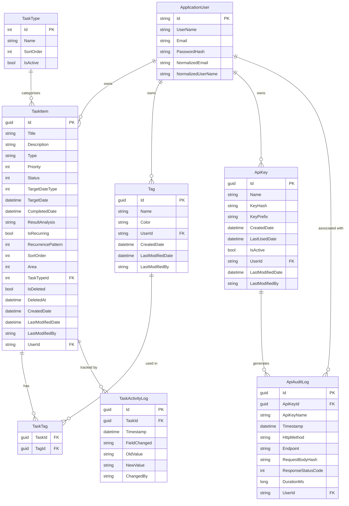

# TaskPilot — Architecture Specification

> **Iteration 1** (Local development, SQLite, dotnet user-secrets, dotnet run)
> Every decision is Azure-migration-ready. Local → Azure is a configuration change, not a rewrite.

---

## Table of Contents
1. [Solution Structure](#1-solution-structure)
2. [Entity Relationship Diagram](#2-entity-relationship-diagram)
3. [API Endpoint Specification](#3-api-endpoint-specification)
4. [Authentication & Security Design](#4-authentication--security-design)
5. [Coding Standards & Patterns](#5-coding-standards--patterns)
6. [Database Indexing Strategy](#6-database-indexing-strategy)
7. [Azure Migration Map](#7-azure-migration-map)
8. [Iteration 2 Backlog](#8-iteration-2-backlog)
9. [Package Decisions](#9-package-decisions)
10. [Configuration Guide](#10-configuration-guide)
11. [LLM Integration](#11-llm-integration)
12. [Health & Diagnostics](#12-health--diagnostics)

---

## 1. Solution Structure

```
c:\projects\TaskPilot\
├── TaskPilot.slnx
├── ARCHITECTURE.md             ← This file
├── CLAUDE.md                   ← Agent coding conventions
├── DESIGN-SYSTEM.md            ← UX visual spec
├── WIREFRAMES.md               ← Page layout specs
├── USER-FLOWS.md               ← Interaction flows
├── README.md
├── .gitignore
│
├── src/                        ← Single application project (TaskPilot)
│   ├── TaskPilot.csproj        ← ASP.NET Core 10 Web + Razor Pages
│   ├── Program.cs              ← App entry point, middleware pipeline
│   ├── appsettings.json
│   ├── appsettings.Development.json
│   │
│   ├── Controllers/            ← REST API (namespace: TaskPilot.Controllers)
│   │   ├── BaseApiController.cs
│   │   ├── TasksController.cs
│   │   ├── TagsController.cs
│   │   ├── ApiKeysController.cs
│   │   ├── AuditController.cs
│   │   ├── ActivityLogController.cs
│   │   └── AccountController.cs
│   │
│   ├── Pages/                  ← Razor Pages web UI (namespace: TaskPilot.Pages)
│   │   ├── _ViewImports.cshtml
│   │   ├── _ViewStart.cshtml
│   │   ├── Index.cshtml(.cs)   ← Dashboard
│   │   ├── Error.cshtml(.cs)
│   │   ├── Auth/
│   │   │   ├── Login.cshtml(.cs)
│   │   │   ├── Register.cshtml(.cs)
│   │   │   └── Logout.cshtml(.cs)
│   │   ├── Tasks/
│   │   │   ├── Index.cshtml(.cs)   ← List + Board view
│   │   │   └── Detail.cshtml(.cs)  ← Edit / Complete / Delete
│   │   ├── Settings/
│   │   │   └── Index.cshtml(.cs)
│   │   ├── Audit/
│   │   │   └── Index.cshtml(.cs)
│   │   ├── Changelog/
│   │   │   └── Index.cshtml(.cs)   ← Read-only version history from app-changelog.json
│   │   └── Shared/
│   │       ├── _Layout.cshtml       ← Sidebar nav, Bootstrap 5 + HTMX + ApexCharts CDN
│   │       └── _LoginLayout.cshtml  ← Centered auth card layout
│   │
│   ├── app-changelog.json      ← Version history (no DB; read once at startup by ChangelogService)
│   │
│   ├── Models/                 ← DTOs, enums, validators (namespace: TaskPilot.Models)
│   │   ├── Tasks/
│   │   │   ├── TaskResponse.cs
│   │   │   ├── CreateTaskRequest.cs
│   │   │   ├── UpdateTaskRequest.cs
│   │   │   ├── PatchTaskRequest.cs
│   │   │   ├── CompleteTaskRequest.cs
│   │   │   └── TaskQueryParams.cs
│   │   ├── Tags/
│   │   │   ├── TagResponse.cs
│   │   │   └── CreateTagRequest.cs
│   │   ├── TaskTypes/
│   │   │   └── TaskTypeResponse.cs
│   │   ├── ApiKeys/
│   │   │   ├── ApiKeyResponse.cs
│   │   │   ├── CreateApiKeyRequest.cs
│   │   │   └── RenameApiKeyRequest.cs
│   │   ├── Audit/
│   │   │   └── AuditLogResponse.cs
│   │   ├── Changelog/
│   │   │   └── ChangelogModels.cs  ← ChangelogVersion, ChangelogEntry records
│   │   ├── Stats/
│   │   │   └── StatsResponse.cs
│   │   ├── Common/
│   │   │   └── ApiResponse.cs      ← Response envelope types
│   │   ├── Enums/
│   │   │   ├── TaskStatus.cs
│   │   │   ├── TaskPriority.cs
│   │   │   ├── TargetDateType.cs
│   │   │   ├── RecurrencePattern.cs
│   │   │   └── Area.cs              ← Personal = 0, Work = 1 (fixed; no lookup table)
│   │   └── Validators/
│   │       ├── CreateTaskRequestValidator.cs
│   │       ├── UpdateTaskRequestValidator.cs
│   │       ├── CreateTagRequestValidator.cs
│   │       └── CreateApiKeyRequestValidator.cs
│   │
│   ├── Services/               ← Business logic (namespace: TaskPilot.Services)
│   │   ├── Interfaces/
│   │   │   ├── ITaskService.cs
│   │   │   ├── ITagService.cs
│   │   │   ├── IApiKeyService.cs
│   │   │   ├── IAuditService.cs
│   │   │   ├── IActivityLogService.cs
│   │   │   ├── IChangelogService.cs
│   │   │   └── IStatsService.cs
│   │   ├── TaskService.cs
│   │   ├── TagService.cs
│   │   ├── ApiKeyService.cs
│   │   ├── AuditService.cs
│   │   ├── ActivityLogService.cs
│   │   ├── ChangelogService.cs     ← Singleton; reads app-changelog.json once at startup
│   │   └── StatsService.cs
│   │
│   ├── Repositories/           ← Data access (namespace: TaskPilot.Repositories)
│   │   ├── Interfaces/
│   │   │   ├── IRepository.cs       ← Generic CRUD interface
│   │   │   ├── ITaskRepository.cs
│   │   │   ├── ITagRepository.cs
│   │   │   ├── IApiKeyRepository.cs
│   │   │   └── IAuditLogRepository.cs
│   │   ├── GenericRepository.cs
│   │   ├── TaskRepository.cs
│   │   ├── TagRepository.cs
│   │   ├── ApiKeyRepository.cs
│   │   └── AuditLogRepository.cs
│   │
│   ├── Data/                   ← EF Core (namespace: TaskPilot.Data)
│   │   ├── ApplicationDbContext.cs
│   │   ├── DesignTimeDbContextFactory.cs  ← SQL Server factory for `dotnet ef migrations add`
│   │   ├── Configurations/
│   │   │   ├── TaskItemConfiguration.cs
│   │   │   ├── TagConfiguration.cs
│   │   │   ├── TaskTagConfiguration.cs
│   │   │   ├── ApiKeyConfiguration.cs
│   │   │   ├── ApiAuditLogConfiguration.cs
│   │   │   └── TaskActivityLogConfiguration.cs
│   │   └── Migrations/
│   │       └── (SQL Server migrations — applied by MigrateAsync on Azure, EnsureCreatedAsync on SQLite dev)
│   │
│   ├── Entities/               ← Domain entities (namespace: TaskPilot.Entities)
│   │   ├── BaseEntity.cs
│   │   ├── TaskItem.cs
│   │   ├── Tag.cs              ← UI-exposed; users create/manage tags on task forms
│   │   ├── TaskTag.cs          ← Join table; UI-exposed via tag multi-select on task forms
│   │   ├── TaskType.cs         ← Lookup table; seeded via migration; read-only at runtime
│   │   ├── ApiKey.cs
│   │   ├── ApiAuditLog.cs
│   │   └── TaskActivityLog.cs
│   │
│   ├── Middleware/             ← Custom middleware (namespace: TaskPilot.Middleware)
│   │   ├── ApiAuditMiddleware.cs       ← Logs all API-key-authenticated requests
│   │   └── GlobalExceptionMiddleware.cs
│   │
│   ├── Extensions/             ← DI + pipeline + auth handler (namespace: TaskPilot.Extensions)
│   │   ├── ServiceCollectionExtensions.cs  ← All DI registrations
│   │   ├── ApplicationBuilderExtensions.cs ← Middleware pipeline helpers
│   │   └── ApiKeyAuthenticationHandler.cs  ← Custom X-Api-Key auth handler
│   │
│   ├── Constants/              ← App-wide constants (namespace: TaskPilot.Constants)
│   │   ├── ApiRoutes.cs
│   │   ├── AuthConstants.cs
│   │   ├── ErrorCodes.cs
│   │   └── TaskTypes.cs
│   │
│   └── wwwroot/
│       └── css/
│           └── app.css         ← Design system tokens + component styles
│
└── tests/
    ├── TaskPilot.Tests.Unit/
    │   ├── TaskPilot.Tests.Unit.csproj
    │   ├── Services/
    │   │   ├── TaskServiceTests.cs
    │   │   ├── TagServiceTests.cs
    │   │   └── ApiKeyServiceTests.cs
    │   ├── Validators/
    │   │   ├── CreateTaskRequestValidatorTests.cs
    │   │   └── CreateTagRequestValidatorTests.cs
    │   ├── Repositories/
    │   │   └── TaskRepositoryTests.cs
    │   └── Helpers/
    │       └── TestDataBuilder.cs
    │
    ├── TaskPilot.Tests.Integration/
    │   ├── TaskPilot.Tests.Integration.csproj
    │   ├── WebAppFactory.cs
    │   ├── Helpers/
    │   │   └── AuthHelper.cs
    │   └── Api/
    │       ├── TasksApiTests.cs
    │       ├── TagsApiTests.cs
    │       ├── ApiKeysApiTests.cs
    │       └── AuthApiTests.cs
    │
    └── TaskPilot.Tests.E2E/
        ├── TaskPilot.Tests.E2E.csproj
        ├── PlaywrightFixture.cs
        ├── Auth/
        │   └── AuthTests.cs
        ├── Dashboard/
        │   └── DashboardTests.cs
        ├── Tasks/
        │   └── TaskLifecycleTests.cs
        ├── Settings/
        │   └── SettingsTests.cs
        └── Audit/
            └── AuditTests.cs
```

---

## 2. Entity Relationship Diagram



---

## 3. API Endpoint Specification

All endpoints: `Content-Type: application/json`, wrapped in the standard response envelope.

### 3.1 Task Endpoints

| Method | Endpoint | Auth | Request | Success Response | Error Codes |
|--------|----------|------|---------|-----------------|-------------|
| GET | /api/v1/tasks | Cookie or ApiKey | Query: `TaskQueryParams` — `status`/`area`/`priority`/`taskTypeId`/`tagIds`/`search`/`page`/`pageSize`/`sortBy` (one of `title`/`area`/`type`/`priority`/`status`/`targetDate`/`createdDate`/`lastModifiedDate`)/`sortDir`/`includeOnlyIncomplete`/`overdueOnly` | 200 `ApiListResponse<TaskResponse>` | 401 |
| GET | /api/v1/tasks/{id} | Cookie or ApiKey | — | 200 `ApiResponse<TaskResponse>` | 401, 404 |
| POST | /api/v1/tasks | Cookie or ApiKey | `CreateTaskRequest` | 201 `ApiResponse<TaskResponse>` | 400, 401 |
| PUT | /api/v1/tasks/{id} | Cookie or ApiKey | `UpdateTaskRequest` | 200 `ApiResponse<TaskResponse>` | 400, 401, 404 |
| PATCH | /api/v1/tasks/{id} | Cookie or ApiKey | `PatchTaskRequest` | 200 `ApiResponse<TaskResponse>` | 400, 401, 404 |
| DELETE | /api/v1/tasks/{id} | Cookie or ApiKey | — | 204 | 401, 404 |
| POST | /api/v1/tasks/{id}/complete | Cookie or ApiKey | `CompleteTaskRequest` | 200 `ApiResponse<TaskResponse>` | 400, 401, 404, 409 |
| POST | /api/v1/tasks/{id}/clone | Cookie or ApiKey | `CloneTaskRequest` (body optional — empty `{}` is valid) | 201 `ApiResponse<TaskResponse>` (new task) + `Location: /api/v1/tasks/{newId}` | 400, 401, 404 |
| GET | /api/v1/tasks/stats | Cookie or ApiKey | Query: date range | 200 `ApiResponse<StatsResponse>` | 401 |

### 3.1a Task Type Lookup Endpoint

| Method | Endpoint | Auth | Request | Success Response | Error Codes |
|--------|----------|------|---------|-----------------|-------------|
| GET | /api/v1/task-types | Cookie or ApiKey | — | 200 `ApiResponse<List<TaskTypeResponse>>` | 401 |

Returns all active task types ordered by `SortOrder` ascending. This list is used by the UI to populate the task type dropdown. The endpoint is read-only; task types are seeded via migration and are not user-editable.

#### TaskTypeResponse
```csharp
public record TaskTypeResponse
{
    public required int Id { get; init; }
    public required string Name { get; init; }
    public required int SortOrder { get; init; }
}
```

**Seed data** (inserted by migration `AddTaskTypeAreaAndTagsUI`):

| Id | Name | SortOrder |
|----|------|-----------|
| 1 | Task | 1 |
| 2 | Goal | 2 |
| 3 | Habit | 3 |
| 4 | Meeting | 4 |
| 5 | Note | 5 |
| 6 | Event | 6 |

> "Task" (Id=1) is the default general-purpose type. All seed rows have `IsActive = true`.

#### TaskFilterParams (query string)
```csharp
public record TaskFilterParams
{
    public TaskStatus? Status { get; init; }
    public string? Type { get; init; }
    public Priority? Priority { get; init; }
    public string? Search { get; init; }          // full-text on Title + Description
    public string? Tags { get; init; }             // comma-separated tag IDs
    public bool? IsRecurring { get; init; }
    public DateTime? TargetDateFrom { get; init; }
    public DateTime? TargetDateTo { get; init; }
    public int Page { get; init; } = 1;
    public int PageSize { get; init; } = 20;
    public string SortBy { get; init; } = "priority";
    public string SortDir { get; init; } = "asc";
}
```

#### CreateTaskRequest
```csharp
public record CreateTaskRequest
{
    public required string Title { get; init; }         // max 200
    public string? Description { get; init; }
    public required string Type { get; init; }           // legacy free-text type field
    public required Priority Priority { get; init; }
    public TaskStatus Status { get; init; } = TaskStatus.NotStarted;
    public required TargetDateType TargetDateType { get; init; }
    public DateTime? TargetDate { get; init; }
    public bool IsRecurring { get; init; } = false;
    public RecurrencePattern? RecurrencePattern { get; init; }
    public int? TaskTypeId { get; init; }               // optional FK to TaskType lookup table
    public Area Area { get; init; } = Area.Personal;    // 0=Personal (default), 1=Work
    public List<Guid> TagIds { get; init; } = [];       // tag associations (empty = no tags)
}
```

#### UpdateTaskRequest
```csharp
public record UpdateTaskRequest
{
    public required string Title { get; init; }         // max 200
    public string? Description { get; init; }
    public required string Type { get; init; }           // legacy free-text type field
    public required Priority Priority { get; init; }
    public required TaskStatus Status { get; init; }
    public required TargetDateType TargetDateType { get; init; }
    public DateTime? TargetDate { get; init; }
    public bool IsRecurring { get; init; } = false;
    public RecurrencePattern? RecurrencePattern { get; init; }
    public int? TaskTypeId { get; init; }               // optional FK to TaskType lookup table
    public Area Area { get; init; } = Area.Personal;    // 0=Personal (default), 1=Work
    public List<Guid> TagIds { get; init; } = [];       // replaces full tag set on the task
}
```

#### PatchTaskRequest (partial update — all fields optional)
```csharp
public record PatchTaskRequest
{
    public string? Title { get; init; }
    public string? Description { get; init; }
    public string? Type { get; init; }
    public Priority? Priority { get; init; }
    public TaskStatus? Status { get; init; }
    public TargetDateType? TargetDateType { get; init; }
    public DateTime? TargetDate { get; init; }
    public bool? IsRecurring { get; init; }
    public RecurrencePattern? RecurrencePattern { get; init; }
    public int? TaskTypeId { get; init; }               // null = leave unchanged; 0 = clear
    public Area? Area { get; init; }                    // null = leave unchanged
    public List<Guid>? TagIds { get; init; }            // null = leave unchanged; [] = clear all tags
}
```

#### TaskResponse
```csharp
public record TaskResponse
{
    public required Guid Id { get; init; }
    public required string Title { get; init; }
    public string? Description { get; init; }
    public required string Type { get; init; }
    public required Priority Priority { get; init; }
    public required TaskStatus Status { get; init; }
    public required TargetDateType TargetDateType { get; init; }
    public DateTime? TargetDate { get; init; }
    public DateTime? CompletedDate { get; init; }
    public string? ResultAnalysis { get; init; }
    public required bool IsRecurring { get; init; }
    public RecurrencePattern? RecurrencePattern { get; init; }
    public required int SortOrder { get; init; }
    public int? TaskTypeId { get; init; }               // null if not assigned
    public string? TaskTypeName { get; init; }          // null if not assigned
    public required int Area { get; init; }             // 0=Personal, 1=Work (serialised as int)
    public required string AreaName { get; init; }      // "Personal" or "Work"
    public required DateTime CreatedDate { get; init; }
    public required DateTime LastModifiedDate { get; init; }
    public required string LastModifiedBy { get; init; }
    public required List<TagResponse> Tags { get; init; }  // always populated (empty list if none)
}
```

#### StatsResponse (`GET /api/v1/tasks/stats`)
```csharp
public record TaskStatsResponse(
    int TotalActive,
    int CompletedToday,
    int Overdue,
    int InProgress,
    int Blocked,
    IReadOnlyList<WeeklyCompletionData> CompletedPerWeek,
    IReadOnlyList<MonthlyCompletionData> CompletedPerMonth,
    IReadOnlyList<YearlyCompletionData> CompletedPerYear,
    IReadOnlyList<CompletionRateData> CompletionRateByWeek,
    IReadOnlyList<TypeBreakdownData> ByType,
    IReadOnlyList<PriorityBreakdownData> ByPriority,
    IReadOnlyList<AvgCompletionData> AvgTimeToCompletionByWeek,
    CompletionsByAreaData CompletionsByArea,              // breakdown by Personal vs Work
    IReadOnlyList<TagTaskCountData> TopTags               // top 5 tags by task count
);

public record CompletionsByAreaData(int Personal, int Work);
public record TagTaskCountData(string TagName, int TaskCount);
```

> `CompletionsByArea` counts all completed tasks for the queried period split by `Area` value.
> `TopTags` returns the top 5 tags ranked by number of associated tasks (completed + active) within the period.

### 3.1b Clone Task Endpoint

`POST /api/v1/tasks/{id}/clone` duplicates an existing `TaskItem` owned by the caller and returns the newly-created task wrapped in the standard envelope. Same auth schemes as the rest of the Task endpoints (Cookie for the web UI, `X-Api-Key` for REST clients). The caller may pass an empty body (`{}`) for a pure duplicate, or supply allowed overrides on the request.

#### CloneTaskRequest

```csharp
// src/Models/Tasks/CloneTaskRequest.cs
public record CloneTaskRequest(
    string? Title = null,            // override; null = use "<source title> (copy)"
    DateTime? TargetDate = null,     // override; ignored when ClearTargetDate is true
    bool ClearTargetDate = false     // if true, new task's TargetDate is set to null regardless of source
);
```

Notes:
- The DTO is deliberately tiny. Any other field the caller wants different on the clone is a `PATCH /api/v1/tasks/{newId}` follow-up. Keeping `CloneTaskRequest` narrow avoids re-implementing the full create/update validation matrix and avoids the "is this a copy or a brand-new task" semantic ambiguity.
- `Title`: when supplied, used verbatim (still subject to the standard 200-char limit). When null/empty/whitespace, the service produces `"{source.Title} (copy)"`. The service does NOT attempt to detect or increment an existing `(copy)` suffix in iteration 1 — `"Foo (copy) (copy)"` is acceptable on a double clone.
- `TargetDate` + `ClearTargetDate`: these two fields encode three caller intents on a nullable column:
  - both unset → copy source's `TargetDate` verbatim
  - `TargetDate` supplied, `ClearTargetDate = false` → use the supplied date
  - `ClearTargetDate = true` → force `TargetDate = null` (and `TargetDate` in the request body is ignored)

  Reason for the explicit flag: `TargetDate = null` in JSON is indistinguishable from "field omitted" with a nullable record property, so we cannot use null alone to mean "clear it." This mirrors the discriminator pattern PATCH uses across the codebase.
- `TargetDateType` is NOT overridable on clone. If the caller passes a `TargetDate` override and the source's `TargetDateType` is `SpecificDay`, the override is honoured as-is. If the source's `TargetDateType` is `ThisWeek` / `ThisMonth`, the override is still stored on `TargetDate` (the field is meaningful for those types per existing semantics) but the type is not changed. Callers needing to switch type should PATCH the clone afterwards.

#### CloneTaskRequest validation (FluentValidation)

```csharp
// src/Models/Validators/CloneTaskRequestValidator.cs (new)
// Rules:
//   - When Title is non-null and not whitespace, it must be <= 200 chars.
//     (Whitespace-only Title is treated as "use default" — same as omitting the field.)
//   - No validation on TargetDate (any DateTime is acceptable; semantic interpretation
//     is the service's job).
//   - ClearTargetDate has no validation — it's a bool with default false.
```

Controllers run the validator before calling the service (per the existing `BaseApiController` pattern). Failure returns `400` with the standard `ValidationError` envelope.

#### Clone semantics (authoritative table)

| Source field | Clone behaviour | Override allowed? |
|---|---|---|
| `Id` | Fresh `Guid.NewGuid()` (BaseEntity init) | No |
| `Title` | `"{source.Title} (copy)"` | Yes — `CloneTaskRequest.Title` |
| `Description` | Copied verbatim | No (PATCH after) |
| `TaskTypeId` | Copied verbatim | No (PATCH after) |
| `Area` | Copied verbatim | No (PATCH after) |
| `Priority` | Copied verbatim | No (PATCH after) |
| `Status` | Always `TaskStatus.NotStarted` | No — see note |
| `TargetDateType` | Copied verbatim | No |
| `TargetDate` | Copied verbatim | Yes — `TargetDate` / `ClearTargetDate` |
| `CompletedDate` | `null` | No |
| `ResultAnalysis` | `null` | No |
| `IsRecurring` | Copied verbatim | No |
| `RecurrencePattern` | Copied verbatim | No |
| `SortOrder` | `MaxSortOrder(userId) + 1` (same rule as `CreateTaskAsync`) | No |
| `IsDeleted` | `false` | No |
| `DeletedAt` | `null` | No |
| `UserId` | Copied verbatim from source | No — cross-user clones are not exposed |
| `TaskTags` | New `TaskTag` rows referencing the same `TagId` set | No (PATCH after) |
| `ActivityLogs` | NOT copied. Exactly one new entry on the clone (see below). | No |
| `CreatedDate` / `LastModifiedDate` | Set by `DbContext.SaveChangesAsync` override | n/a |
| `LastModifiedBy` | Set by service to `modifiedBy` (caller identity) | n/a |

**Deviation from the brief** (one and only one): the brief proposed `Status → reset to Active`. The codebase enum is `TaskPilot.Models.Enums.TaskStatus` with members `NotStarted`, `InProgress`, `Blocked`, `Completed`, `Cancelled` — there is no `Active` member. `Active` in this codebase is a UI/filter concept ("anything not Completed or Cancelled"). The service therefore sets `Status = TaskStatus.NotStarted` on the clone, which is the same default `CreateTaskAsync` uses when no status is supplied and matches the v1.12 "active" view default for newly created tasks. This is documented in REQUIREMENTS.md §5.1 as well.

Cloning a source whose `Status` is `Completed` or `Cancelled` is allowed — the clone simply starts in `NotStarted`. The brief's "never clone Completed/Cancelled" intent is preserved (the clone is never created in a terminal state); we just don't block the operation on the source's state.

#### ActivityLog entry on the clone

Exactly one row is inserted into `TaskActivityLog` against the new task. Source task ActivityLogs are NOT copied. The source task does NOT get a "cloned to" entry — see justification below.

| Field | Value |
|---|---|
| `Id` | `Guid.NewGuid()` |
| `TaskId` | New task's `Id` |
| `Timestamp` | `DateTime.UtcNow` |
| `FieldChanged` | `"Created"` (matches the literal used by `CreateTaskAsync` so the activity-log UI renders it identically to a hand-created task) |
| `OldValue` | `null` |
| `NewValue` | `$"Cloned from {sourceId:D}"` (lowercase 36-char GUID, no braces — matches the `:D` format used elsewhere) |
| `ChangedBy` | `modifiedBy` (`"user:{username}"` or `"api:{apiKeyName}"` per `BaseApiController.ModifiedBy`) |

Why not also write a "Cloned to {newId}" log row on the **source** task:

1. **Source immutability**: the clone operation does not modify any field on the source. Adding a child row would force `LastModifiedDate` to advance on the source (the `SaveChangesAsync` override stamps every tracked entity, and child-collection insert marks the parent as `Modified` in EF Core) — that is a behavioural surprise (e.g. it would re-order tasks sorted by "last modified" and bump the source up the list).
2. **Audit-trail equivalence**: the clone's `NewValue = "Cloned from {sourceId}"` is fully traceable in either direction (the activity-log query API lets the UI render a back-link from clone → source). The source needs no entry to preserve full provenance.
3. **Cost asymmetry**: source-side logging would require an additional change-tracker write for every clone — wasted I/O for an unused field.

If "see all derivatives of this task" becomes a product requirement later, it should be implemented as a `ParentTaskId` column + index — not as a denormalised activity log entry. That is iteration 2 backlog material; the schema change is **not** part of this feature.

#### Status codes

| Code | When |
|---|---|
| `201 Created` | Clone succeeded. Response body = `ApiResponse<TaskResponse>` for the new task. `Location` header = `/api/v1/tasks/{newId}` (use `CreatedAtAction(nameof(GetTask), ...)`, matching `CreateTask`). |
| `400 Bad Request` | `CloneTaskRequest` failed FluentValidation (e.g. `Title` > 200 chars). Standard `ValidationError` envelope. |
| `401 Unauthorized` | No auth or invalid auth. Handled by the existing auth pipeline. |
| `404 Not Found` | Source task does not exist, is soft-deleted (`IsDeleted = true`), or is owned by a different user. All three collapse to the same 404 — we do NOT distinguish "not found" from "not yours" (information-disclosure rule). Standard `NotFoundError("Task")` envelope. |

There is intentionally no `409 Conflict`. There is no state on the source that can cause a clone to be rejected — a Completed/Cancelled source clones just fine into a `NotStarted` clone.

#### Service-layer signature

```csharp
// src/Services/Interfaces/ITaskService.cs (new method appended)
Task<TaskResponse?> CloneTaskAsync(
    Guid sourceId,
    CloneTaskRequest request,
    string userId,
    string modifiedBy,
    CancellationToken cancellationToken = default);
```

- Returns `null` if the source is not found / soft-deleted / not owned by `userId`. Controller maps `null` → `404` using the existing `NotFoundError("Task")` helper.
- Returns the mapped `TaskResponse` for the new task on success. Controller wraps it in `Envelope(...)` and emits `201 CreatedAtAction(nameof(GetTask), new { id = result.Id }, Envelope(result))`.

#### Repository touchpoints

No new repository methods. The service uses only existing methods on `ITaskRepository`:

| Method | Used for |
|---|---|
| `GetByIdWithTagsAsync(sourceId, userId, ct)` | Load source with `TaskTags` and `Tag` navigation populated. The global `!IsDeleted` query filter on `TaskItem` makes this return `null` for soft-deleted sources without any extra code — the brief's "404 on soft-deleted source" requirement is satisfied for free. |
| `GetMaxSortOrderAsync(userId, ct)` | Compute the new task's `SortOrder` (same rule `CreateTaskAsync` uses). |
| `AddAsync(newTask, ct)` | Insert the new task. EF Core cascades the `TaskTag` and `TaskActivityLog` children automatically because they are added to the parent's collections before `AddAsync`. |
| `SaveChangesAsync(ct)` | Persist everything in a single `INSERT` batch (see Concurrency below). |

The service does NOT need to call `TagRepository.GetByIdsAsync` — tag IDs are read directly off `source.TaskTags`, so there is no extra round-trip to validate tags exist (they already exist; they were on the source). This is a deliberate efficiency improvement over the `CreateTaskAsync` path, which can't make that assumption.

#### Concurrency / transactional guarantees

The full clone (new `TaskItem` row, N `TaskTag` rows, 1 `TaskActivityLog` row) is wrapped in a **single `SaveChangesAsync` call** on `ApplicationDbContext`. EF Core wraps a single `SaveChanges` in a database transaction by default on every supported provider (SQLite, SQL Server, PostgreSQL), so the insert is atomic without any explicit `BeginTransaction` call.

Pattern, matching `CreateTaskAsync` exactly:

1. Build the new `TaskItem` in-memory with `TaskTags` and `ActivityLogs` populated.
2. `await taskRepository.AddAsync(newTask, ct);`
3. `await taskRepository.SaveChangesAsync(ct);`

No explicit transaction scope is required and none should be introduced — adding one would deviate from the established pattern in `CreateTaskAsync`, `UpdateTaskAsync`, `CompleteTaskAsync`, and `DeleteTaskAsync`, and would not change the guarantee. The codebase currently uses zero `BeginTransactionAsync` calls; this feature does not introduce the first.

Concurrency: two simultaneous clones from the same user can both compute the same `MaxSortOrder + 1` and both insert with the same `SortOrder`. This is the same race that exists today on `CreateTaskAsync` and is accepted — `SortOrder` is a display ordering hint, not a uniqueness constraint, and ties are broken deterministically by the existing list-query ordering. No new mitigation introduced for clone.

#### Authorisation

Clone uses the **exact same ownership check** as Get/Update/Delete: the `userId` argument to `ITaskRepository.GetByIdWithTagsAsync(id, userId, ct)` is appended as a `WHERE UserId = @userId` predicate. If the source belongs to a different user, the repository returns `null` and the controller emits `404`. No separate authorization handler / requirement is needed — ownership is encoded in the query predicate, identically to every other Task endpoint.

`userId` is obtained from `BaseApiController.UserId` (which reads `ClaimTypes.NameIdentifier` and works identically under both cookie and `X-Api-Key` schemes). `modifiedBy` is obtained from `BaseApiController.ModifiedBy`. No new claims, no new policies.

There is no separate "can clone" permission. If the caller can read the source (it would appear in a `GET /api/v1/tasks/{id}` response), they can clone it. This matches the existing principle that any reader of a task is also its owner — TaskPilot has no shared/team tasks in iteration 1.

#### Controller skeleton (signature only — no body)

```csharp
// src/Controllers/TasksController.cs (new action — body to be written by fullstack-dev)
[HttpPost("{id:guid}/clone")]
public async Task<IActionResult> CloneTask(
    Guid id,
    [FromBody] CloneTaskRequest? request,
    [FromServices] IValidator<CloneTaskRequest> validator,
    CancellationToken cancellationToken);
```

- `request` is nullable so that callers can `POST` with no body or `Content-Length: 0`. Inside the action, `request ??= new CloneTaskRequest();` before validation.
- Controller follows the standard pattern: validate → call `taskService.CloneTaskAsync(id, request, UserId, ModifiedBy, ct)` → on null return `NotFound(NotFoundError("Task"))` → on success return `CreatedAtAction(nameof(GetTask), new { id = result.Id }, Envelope(result))`.
- No business logic in the controller.

### 3.2 Tag Endpoints

| Method | Endpoint | Auth | Request | Success Response | Error Codes |
|--------|----------|------|---------|-----------------|-------------|
| GET | /api/v1/tags | Cookie or ApiKey | — | 200 `ApiListResponse<TagResponse>` | 401 |
| POST | /api/v1/tags | Cookie or ApiKey | `CreateTagRequest` | 201 `ApiResponse<TagResponse>` | 400, 401, 409 |
| PUT | /api/v1/tags/{id} | Cookie or ApiKey | `UpdateTagRequest` | 200 `ApiResponse<TagResponse>` | 400, 401, 404, 409 |
| DELETE | /api/v1/tags/{id} | Cookie or ApiKey | — | 204 | 401, 404 |

### 3.3 API Key Endpoints

| Method | Endpoint | Auth | Request | Success Response | Error Codes |
|--------|----------|------|---------|-----------------|-------------|
| GET | /api/v1/apikeys | Cookie | — | 200 `ApiListResponse<ApiKeyResponse>` | 401 |
| POST | /api/v1/apikeys | Cookie | `GenerateApiKeyRequest` | 201 `ApiResponse<GeneratedApiKeyResponse>` | 400, 401 |
| PATCH | /api/v1/apikeys/{id}/deactivate | Cookie | — | 200 `ApiResponse<ApiKeyResponse>` | 401, 404 |
| PATCH | /api/v1/apikeys/{id}/activate | Cookie | — | 200 `ApiResponse<ApiKeyResponse>` | 401, 404 |
| DELETE | /api/v1/apikeys/{id} | Cookie | — | 204 | 401, 404 |

> Note: `GeneratedApiKeyResponse` includes the plaintext `FullKey` field. This is the ONLY time the plaintext key is returned. After this response, the key cannot be retrieved.

### 3.4 Audit Log Endpoints

| Method | Endpoint | Auth | Request | Success Response | Error Codes |
|--------|----------|------|---------|-----------------|-------------|
| GET | /api/v1/audit | Cookie/ApiKey | Query: `AuditQueryParams` | 200 `PagedApiResponse<AuditLogResponse>` | 401 |
| GET | /api/v1/audit/summary | Cookie/ApiKey | — | 200 `ApiResponse<AuditSummaryResponse>` | 401 |

> There are NO write endpoints for API audit logs. Audit logs are immutable.

### 3.5 Activity Log Endpoints

| Method | Endpoint | Auth | Request | Success Response | Error Codes |
|--------|----------|------|---------|-----------------|-------------|
| GET | /api/v1/activity-logs | Cookie/ApiKey | Query: `ActivityLogQueryParams` | 200 `PagedApiResponse<ActivityLogResponse>` | 401 |

**Query parameters for `ActivityLogQueryParams`:**
- `taskId` (Guid?) — filter to a specific task
- `from` / `to` (DateTime?) — date range filter
- `fieldChanged` (string?) — exact field name filter (e.g. `Status`, `Title`)
- `changedBy` (string?) — partial match on modifier (e.g. `user:` or `api:`)
- `page` / `pageSize` (int, defaults: 1/50)

> Activity logs are read-only. They are written automatically whenever a task field is mutated.

### 3.4b Health & Diagnostics Endpoints

| Method | Endpoint | Auth | Request | Success Response | Error Codes |
|--------|----------|------|---------|-----------------|-------------|
| GET | /api/v1/health/version | Anonymous | — | 200 `ApiResponse<VersionResponse>` | — |
| GET | /api/v1/health/live | Anonymous | — | 200 `ApiResponse<LivenessResponse>` | — |
| GET | /api/v1/health/ready | Anonymous | — | 200 `ApiResponse<HealthResponse>` | 503 |
| GET | /api/v1/health/full | Anonymous | — | 200 `ApiResponse<HealthResponse>` | 503 |
| GET | /api/v1/health/assets | Anonymous | — | 200 `ApiResponse<AssetsResponse>` | — |
| GET | /health | Anonymous | — | 200 HTML (Razor Page) | — |

All `/api/v1/health/*` responses include headers: `Cache-Control: no-store, no-cache, must-revalidate`, `Pragma: no-cache`, `Expires: 0`. Full design: see [§12 Health & Diagnostics](#12-health--diagnostics).

### 3.5 Response Envelope Types

```csharp
// src/Models/Common/ApiResponse.cs
public record ApiResponse<T>
{
    public required T Data { get; init; }
    public required ResponseMeta Meta { get; init; }
}

public record ApiListResponse<T>
{
    public required List<T> Data { get; init; }
    public required ListResponseMeta Meta { get; init; }
}

public record ResponseMeta
{
    public required DateTime Timestamp { get; init; }
    public required string RequestId { get; init; }
}

public record ListResponseMeta : ResponseMeta
{
    public required int Page { get; init; }
    public required int PageSize { get; init; }
    public required int TotalCount { get; init; }
    public required int TotalPages { get; init; }
}

public record ApiErrorResponse
{
    public required ErrorDetail Error { get; init; }
}

public record ErrorDetail
{
    public required string Code { get; init; }
    public required string Message { get; init; }
    public List<FieldError>? Details { get; init; }
}

public record FieldError
{
    public required string Field { get; init; }
    public required string Message { get; init; }
}
```

---

## 4. Authentication & Security Design

### 4.1 Cookie Authentication (Web UI)

ASP.NET Core Identity with cookie authentication for the Razor Pages web UI.

**Password policy:**
- MinimumLength: 10
- RequireDigit: true
- RequireLowercase: true
- RequireUppercase: true
- RequireNonAlphanumeric: true

**Lockout policy:**
- DefaultLockoutTimeSpan: 15 minutes
- MaxFailedAccessAttempts: 5
- AllowedForNewUsers: true

**Cookie settings (iteration 1):**
```csharp
options.Cookie.HttpOnly = true;
options.Cookie.SameSite = SameSiteMode.Strict;
options.Cookie.SecurePolicy = CookieSecurePolicy.SameAsRequest; // → Always in iteration 2
options.ExpireTimeSpan = TimeSpan.FromDays(14);
options.SlidingExpiration = true;
```

### 4.2 API Key Authentication Handler

Custom `AuthenticationHandler<AuthenticationSchemeOptions>` reading the `X-Api-Key` header.

**Key generation:**
1. Generate 32 cryptographically random bytes: `RandomNumberGenerator.GetBytes(32)`
2. Encode to Base64URL string (43 chars): `Convert.ToBase64String(bytes).TrimEnd('=').Replace('+', '-').Replace('/', '_')`
3. Store prefix (first 8 chars) as `KeyPrefix` for display
4. Hash the full key with HMAC-SHA256: `HMACSHA256(key: secretSigningKey, data: apiKey)`
5. Store hex-encoded hash as `KeyHash`
6. Return the plaintext key to the user ONCE — never store or return it again

**Validation flow:**
1. Extract value from `X-Api-Key` header
2. Validate format (non-empty, length check)
3. Compute HMAC-SHA256 hash of received key
4. Look up `KeyHash` in `ApiKey` table (using hash — never plaintext lookup)
5. Verify `IsActive == true`
6. Update `LastUsedDate` (non-blocking fire-and-forget)
7. Set `ClaimsPrincipal` with user ID and API key name claims

**HMAC signing key** stored in `dotnet user-secrets` as `ApiKey:HmacSigningKey` (iteration 1), Azure Key Vault in iteration 2.

### 4.3 Audit Logging Middleware

`ApiKeyAuditMiddleware` fires on all requests authenticated via the API key scheme.

```csharp
// Captures per request:
// - ApiKeyId + ApiKeyName (from Claims)
// - Timestamp (UTC)
// - HttpMethod
// - Endpoint (path without query string)
// - RequestBodyHash: SHA256 of request body bytes (never store full body)
// - ResponseStatusCode (captured post-execution via wrapping the response stream)
// - DurationMs (Stopwatch)
// - UserId (from Claims)
```

Runs **after** authentication middleware, **before** routing. Records one `ApiAuditLog` row per request regardless of success/failure.

### 4.4 Soft Delete Pattern

Global EF Core query filter on `TaskItem`:
```csharp
// In ApplicationDbContext.OnModelCreating:
modelBuilder.Entity<TaskItem>()
    .HasQueryFilter(t => !t.IsDeleted);
```

Service-layer soft-delete:
```csharp
task.IsDeleted = true;
task.DeletedAt = DateTime.UtcNow;
await _repository.UpdateAsync(task);
```

Use `IgnoreQueryFilters()` only for:
- Undo operations (must retrieve the soft-deleted item)
- Admin/background cleanup jobs
- The 30-second undo window check

### 4.5 Security Headers Middleware

Sets on every response:
```
X-Content-Type-Options: nosniff
X-Frame-Options: DENY
Referrer-Policy: strict-origin-when-cross-origin
```

Iteration 2 additions (document only, not implemented in v1):
- `Strict-Transport-Security: max-age=31536000; includeSubDomains`
- `Content-Security-Policy: default-src 'self'; ...` (needs allowlisting for CDN domains in iteration 2)

### 4.6 Global Exception Handler Middleware

Catches all unhandled exceptions, logs full detail via `ILogger`, and returns the error envelope:

- **Development**: includes exception message
- **Production**: returns generic `"An unexpected error occurred"` — NO stack traces, NO internal type names, NO exception messages

Always returns `application/json` `Content-Type`.

### 4.7 CORS Policy

**Iteration 1 (localhost):**
```csharp
policy.SetIsOriginAllowed(origin => new Uri(origin).Host == "localhost")  // localhost dev
      .AllowAnyMethod()
      .AllowAnyHeader()
      .AllowCredentials();
```

**Iteration 2 (production):** Replace origin with the Azure App Service URL. Never use `AllowAnyOrigin()`.

### 4.8 Rate Limiting — Insertion Point (document only)

In `Program.cs`, rate limiting middleware inserts here:
```csharp
app.UseAuthentication();
app.UseAuthorization();
// ← INSERT: app.UseRateLimiter(); here in iteration 2
app.MapControllers();
```

**Iteration 2 policy design:** Per-API-key sliding window limiter using `RateLimitPartition.GetSlidingWindowLimiter` keyed on the API key ID claim. Web UI requests exempt. Configuration: 100 requests/minute per key default, configurable per key.

---

## 5. Coding Standards & Patterns

### 5.1 BaseEntity

```csharp
// src/Entities/BaseEntity.cs
public abstract class BaseEntity
{
    public Guid Id { get; set; } = Guid.NewGuid();
    public DateTime CreatedDate { get; set; }
    public DateTime LastModifiedDate { get; set; }
    public required string LastModifiedBy { get; set; }
}
```

### 5.2 DbContext SaveChangesAsync Override

```csharp
public override async Task<int> SaveChangesAsync(CancellationToken cancellationToken = default)
{
    var now = DateTime.UtcNow;
    foreach (var entry in ChangeTracker.Entries<BaseEntity>())
    {
        if (entry.State == EntityState.Added)
            entry.Entity.CreatedDate = now;
        if (entry.State is EntityState.Added or EntityState.Modified)
            entry.Entity.LastModifiedDate = now;
    }
    return await base.SaveChangesAsync(cancellationToken);
}
```

### 5.3 Generic Repository Interface

```csharp
// src/Repositories/Interfaces/IRepository.cs
public interface IRepository<T> where T : BaseEntity
{
    Task<T?> GetByIdAsync(Guid id, CancellationToken ct = default);
    Task<List<T>> GetAllAsync(CancellationToken ct = default);
    Task<T> AddAsync(T entity, CancellationToken ct = default);
    Task<T> UpdateAsync(T entity, CancellationToken ct = default);
    Task DeleteAsync(Guid id, CancellationToken ct = default);
    Task<bool> ExistsAsync(Guid id, CancellationToken ct = default);
}
```

### 5.4 Specialized ITaskRepository

```csharp
public interface ITaskRepository : IRepository<TaskItem>
{
    Task<PagedResult<TaskItem>> GetFilteredAsync(TaskFilterParams filters, string userId, CancellationToken ct = default);
    Task<List<TaskItem>> GetByUserAsync(string userId, CancellationToken ct = default);
    Task<TaskItem?> GetWithTagsAsync(Guid id, string userId, CancellationToken ct = default);
    Task UpdateSortOrderAsync(List<(Guid Id, int SortOrder)> updates, CancellationToken ct = default);
}
```

### 5.5 ServiceCollectionExtensions

```csharp
// src/Extensions/ServiceCollectionExtensions.cs
public static class ServiceCollectionExtensions
{
    public static IServiceCollection AddTaskPilotServices(this IServiceCollection services, IConfiguration configuration)
    {
        // Repositories
        services.AddScoped(typeof(IRepository<>), typeof(Repository<>));
        services.AddScoped<ITaskRepository, TaskRepository>();
        services.AddScoped<ITagRepository, TagRepository>();
        services.AddScoped<IApiKeyRepository, ApiKeyRepository>();
        services.AddScoped<IAuditRepository, AuditRepository>();

        // Services
        services.AddScoped<ITaskService, TaskService>();
        services.AddScoped<ITagService, TagService>();
        services.AddScoped<IApiKeyService, ApiKeyService>();
        services.AddScoped<IAuditService, AuditService>();
        services.AddScoped<IStatsService, StatsService>();

        // Validators
        services.AddValidatorsFromAssemblyContaining<CreateTaskRequestValidator>();
        services.AddFluentValidationAutoValidation();

        return services;
    }
}
```

### 5.6 Controller Pattern (NO business logic)

```csharp
[ApiController]
[Route("api/v1/tasks")]
[Authorize]
public class TasksController : ControllerBase
{
    private readonly ITaskService _taskService;
    private readonly ILogger<TasksController> _logger;

    public TasksController(ITaskService taskService, ILogger<TasksController> logger)
    {
        _taskService = taskService;
        _logger = logger;
    }

    /// <summary>Creates a new task.</summary>
    [HttpPost]
    public async Task<IActionResult> CreateAsync([FromBody] CreateTaskRequest request, CancellationToken ct)
    {
        // FluentValidation runs automatically via middleware — no manual validation here
        var userId = User.GetUserId();   // extension method on ClaimsPrincipal
        var result = await _taskService.CreateAsync(request, userId, ct);
        return CreatedAtAction(nameof(GetByIdAsync), new { id = result.Id },
            new ApiResponse<TaskResponse> { Data = result, Meta = ResponseMeta.Now() });
    }
}
```

### 5.7 Layering Rule

```
HTTP Request
    → FluentValidation (auto, before controller)
    → Controller (extract claims, call service, wrap response)
    → Service (business logic, orchestration, activity log writes)
    → Repository (data access only, no logic)
    → DbContext (EF Core, SaveChanges auto-sets dates)
```

**Never**: Controller → DbContext. Service → HttpContext. Repository → another Service.

### 5.8 Enum Serialisation — Area

The `Area` enum **must always be serialised as an integer** in all JSON responses. Do NOT apply `JsonStringEnumConverter` to this enum. This is the default .NET `System.Text.Json` behaviour and must be preserved explicitly — do not add a global `StringEnumConverter` that would affect `Area`.

```csharp
// Models/Enums/Area.cs
public enum Area
{
    Personal = 0,   // default
    Work = 1
}
```

JSON output: `"area": 0` (Personal) or `"area": 1` (Work). The companion `areaName` string field on `TaskResponse` provides the human-readable label.

> **Design decision**: `Area` is intentionally a fixed enum (not a lookup table). The two-value set (Personal / Work) is a stable product constraint and does not warrant a DB table, migration seed, or admin UI.

---

## 6. Database Indexing Strategy

All indexes defined in `IEntityTypeConfiguration<T>` classes.

| Table | Index | Justification |
|-------|-------|---------------|
| TaskItem | `(UserId, IsDeleted, Status)` | Primary filter for task list views (all user's active tasks by status) |
| TaskItem | `(UserId, IsDeleted, TargetDate)` | Dashboard overdue calculation, date-range filtering |
| TaskItem | `(UserId, IsDeleted, CompletedDate)` | Dashboard completion charts (weekly/monthly/yearly aggregations) |
| TaskItem | `(UserId, IsDeleted, Priority)` | Default sort within status groups |
| TaskItem | `(UserId, IsDeleted, Type)` | Type-filter on task list, type breakdown chart |
| ApiAuditLog | `(UserId, Timestamp DESC)` | Audit dashboard default view (user's audit logs newest-first) |
| ApiAuditLog | `(ApiKeyId, Timestamp DESC)` | Per-key filtering in audit dashboard |
| TaskActivityLog | `(TaskId, Timestamp DESC)` | Task detail activity feed (chronological per task) |
| ApiKey | `KeyHash` UNIQUE | API key lookup during authentication (must be fast + unique) |
| ApiKey | `(UserId, IsActive)` | List user's active keys in Settings |
| Tag | `(UserId, Name)` UNIQUE | Prevent duplicate tag names per user, lookup by name |

---

## 7. Azure Migration Map

| Concern | Iteration 1 (Local) | Iteration 2 (Azure) | Migration Steps |
|---------|---------------------|---------------------|-----------------|
| **Database** | SQLite, file-based | Azure SQL Database or PostgreSQL Flexible Server | ✅ **Implemented (iter 1):** `Microsoft.EntityFrameworkCore.SqlServer` added; `DesignTimeDbContextFactory` generates SQL Server-typed migrations; `Program.cs` runs `EnsureCreatedAsync` (dev) vs `MigrateAsync` (prod); `appsettings.Production.json` has placeholder connection string |
| **Secrets** | `dotnet user-secrets` | Azure Key Vault | 1. Add `Azure.Extensions.AspNetCore.Configuration.Secrets` 2. Add `Azure.Identity` 3. In `Program.cs`: `builder.Configuration.AddAzureKeyVault(...)` 4. Replace `user-secrets` key names with Key Vault secret names |
| **Logging** | Console + File (Serilog) | Application Insights | ✅ **Partially implemented (iter 1):** `appsettings.Production.json` configures Console-only Serilog (no file sink — App Service filesystem is ephemeral). Full App Insights integration deferred to iter 2. |
| **Hosting** | `dotnet run` | Azure App Service (Linux) | 1. Configure App Service: WebSockets ON, Session Affinity ON 2. Set `ASPNETCORE_ENVIRONMENT=Production` in App Settings 3. Deploy via GitHub Actions (see iteration 2 backlog) |
| **Static Files** | `wwwroot/` served by Kestrel | Azure App Service static file serving | No change needed — App Service serves `wwwroot/` automatically |
| **CORS** | `SetIsOriginAllowed(localhost)` | Azure app URL | Change to `WithOrigins("https://yourdomain.azurewebsites.net")` in `appsettings.Production.json` |
| **Cookie Security** | `SameAsRequest` (allows HTTP locally) | `CookieSecurePolicy.Always` | Change in `appsettings.Production.json` or env var override |
| **Rate Limiting** | Not implemented | `Microsoft.AspNetCore.RateLimiting` | See iteration 2 backlog. Insertion point documented in section 4.8. |
| **Background Jobs** | In-process (soft-delete cleanup) | Azure Functions or hosted services | Evaluate Azure Functions for scheduled cleanup if App Service scaling is needed |
| **CI/CD** | Manual `dotnet run` | GitHub Actions → Azure | See iteration 2 backlog |

**Configuration switch pattern** (`Program.cs`):
```csharp
if (builder.Environment.IsProduction())
{
    // Azure Key Vault
    builder.Configuration.AddAzureKeyVault(...);
    // Azure SQL / PostgreSQL provider swap happens via connection string
}
```

### 7.1 EF Core Migration Plan — `AddTaskTypeAreaAndTagsUI`

This migration adds the `TaskType` lookup table, the `Area` column, and the `TaskTypeId` FK column to `TaskItem`. It also seeds the initial task type data.

**Generate the migration:**
```bash
dotnet ef migrations add AddTaskTypeAreaAndTagsUI --project src
```

> `DesignTimeDbContextFactory` (at `src/Data/DesignTimeDbContextFactory.cs`) uses the SQL Server provider, so the generated migration uses Azure SQL-compatible column types. The SQLite dev environment applies schema via `EnsureCreatedAsync` and is unaffected by this migration file.

**Key migration details:**

| Concern | Decision |
|---------|----------|
| `TaskTypeId` nullability | Nullable (`int?`) — existing rows have no assigned type and must not fail on migration |
| `Area` default | Column default value `0` (Personal) — no backfill required; all existing rows become "Personal" automatically |
| Seed data | Inserted via `migrationBuilder.InsertData("TaskTypes", ...)` in `Up()`; removed via `migrationBuilder.DeleteData(...)` in `Down()` |
| Production apply | `MigrateAsync()` in `Program.cs` runs automatically on next deploy to Azure — zero-downtime column add |
| Integration tests | `WebAppFactory` uses SQLite + `EnsureCreatedAsync()` — it does NOT run migrations; tests continue to work without change |

**Seed data inserted in `Up()`:**

```csharp
migrationBuilder.InsertData(
    table: "TaskTypes",
    columns: new[] { "Id", "Name", "SortOrder", "IsActive" },
    values: new object[,]
    {
        { 1, "Task",    1, true },
        { 2, "Goal",    2, true },
        { 3, "Habit",   3, true },
        { 4, "Meeting", 4, true },
        { 5, "Note",    5, true },
        { 6, "Event",   6, true }
    });
```

---

## 8. Iteration 2 Backlog

### Rate Limiting
- **Package**: `Microsoft.AspNetCore.RateLimiting` (built into ASP.NET Core 8+)
- **Insertion point**: After `app.UseAuthorization()`, before `app.MapControllers()` (see section 4.8)
- **Policy**: Per-API-key sliding window: 100 req/min default, configurable in DB per ApiKey record
- **Web UI exemption**: Cookie-authenticated requests bypass rate limiting
- **429 response**: Standard error envelope with `Retry-After` header

### PWA Support
- Add `service-worker.js` to Client's `wwwroot`
- Configure `manifest.webmanifest`
- Implement offline fallback page
- Consider background sync for quick-add while offline

### CI/CD (GitHub Actions)
- Build + test workflow on PR
- Deploy workflow on merge to main: build → test → publish → deploy to Azure App Service
- Separate staging slot for preview deployments

### Azure App Service Configuration
- Enable WebSockets (not required for Razor Pages, but harmless and useful for future SignalR)
- Session Affinity: ON (for cookie auth consistency)
- Always On: ON (prevent cold starts)
- Health check endpoint: `GET /health` returning 200

### Application Insights
- Custom telemetry: track task completion events, API key usage
- Smart Detection alerts for error rate spikes
- Availability tests (ping tests from multiple regions)

---

## 9. Package Decisions

### Tags UI, TaskType Lookup, and Area Feature — No New Packages Required

**Decision: No new NuGet packages** for this feature set.

- `TaskType` is a plain EF Core entity with seeded data — no additional ORM or seeding library needed.
- `Area` is a C# enum stored as `int` — handled natively by EF Core and `System.Text.Json`.
- Tag multi-select UI uses existing Bootstrap 5 + HTMX (CDN) — no JavaScript tag library added.
- All migration tooling (`Microsoft.EntityFrameworkCore.Design`, `Microsoft.EntityFrameworkCore.Tools`) was already present from iteration 1.

### Charting Library: ApexCharts (CDN)

**Decision: ApexCharts via CDN** — no NuGet package required

**Rationale:**
- Supports all required chart types: bar (weekly completions), donut (by priority) — with first-class support
- CDN delivery via `<script src="https://cdn.jsdelivr.net/npm/apexcharts">` — zero NuGet dependencies
- Charts initialised with inline `<script>` blocks in Razor views using JSON config
- Active maintenance, large community, excellent documentation

**Rejected alternatives:**
- `Blazor-ApexCharts` (NuGet): Requires Blazor WASM; not applicable to Razor Pages
- `Chart.js`: Comparable but ApexCharts has better donut/bar defaults for dashboards

### UI Stack: Bootstrap 5 + HTMX (CDN)

**Decision: Bootstrap 5 + HTMX + custom CSS** — no NuGet package required

**Rationale:**
- Bootstrap 5 provides modals, tables, forms, badges, buttons — all needed components
- HTMX enables live search (`hx-get`/`hx-trigger`) without JavaScript boilerplate
- Custom CSS in `wwwroot/css/app.css` implements design system tokens (see DESIGN-SYSTEM.md §1)
- All via CDN in `_Layout.cshtml` — zero build tooling

### Complete NuGet Package List

#### TaskPilot (src/TaskPilot.csproj)
```xml
<PackageReference Include="Microsoft.AspNetCore.Identity.EntityFrameworkCore" Version="10.*" />
<PackageReference Include="Microsoft.EntityFrameworkCore.Sqlite" Version="10.*" />
<PackageReference Include="Microsoft.EntityFrameworkCore.SqlServer" Version="10.*" />  <!-- Added iter 1: Azure SQL provider for migrations + production -->
<PackageReference Include="Microsoft.EntityFrameworkCore.Design" Version="10.*" />
<PackageReference Include="Microsoft.EntityFrameworkCore.Tools" Version="10.*" />
<PackageReference Include="FluentValidation.AspNetCore" Version="11.*" />
<PackageReference Include="Serilog.AspNetCore" Version="10.*" />
<PackageReference Include="Serilog.Sinks.Console" Version="6.*" />
<PackageReference Include="Serilog.Sinks.File" Version="7.*" />
<PackageReference Include="Swashbuckle.AspNetCore" Version="10.*" />
<!-- Iteration 2:
<PackageReference Include="Azure.Extensions.AspNetCore.Configuration.Secrets" />
<PackageReference Include="Microsoft.ApplicationInsights.AspNetCore" />
<PackageReference Include="Serilog.Sinks.ApplicationInsights" />
-->
```

#### TaskPilot.Tests.Unit
```xml
<PackageReference Include="xunit" Version="2.*" />
<PackageReference Include="xunit.runner.visualstudio" Version="2.*" />
<PackageReference Include="Microsoft.NET.Test.Sdk" Version="17.*" />
<PackageReference Include="Moq" Version="4.*" />
<PackageReference Include="Microsoft.EntityFrameworkCore.InMemory" Version="10.*" />
```

#### TaskPilot.Tests.Integration
```xml
<PackageReference Include="xunit" Version="2.*" />
<PackageReference Include="xunit.runner.visualstudio" Version="2.*" />
<PackageReference Include="Microsoft.NET.Test.Sdk" Version="17.*" />
<PackageReference Include="Microsoft.AspNetCore.Mvc.Testing" Version="10.*" />
<PackageReference Include="Microsoft.EntityFrameworkCore.Sqlite" Version="10.*" />
```

#### TaskPilot.Tests.E2E
```xml
<PackageReference Include="xunit" Version="2.*" />
<PackageReference Include="xunit.runner.visualstudio" Version="2.*" />
<PackageReference Include="Microsoft.NET.Test.Sdk" Version="17.*" />
<PackageReference Include="Microsoft.Playwright" Version="1.*" />
```

---

## 10. Configuration Guide

### appsettings.json (checked into source control — NO secrets)
```json
{
  "Logging": {
    "LogLevel": {
      "Default": "Information",
      "Microsoft.AspNetCore": "Warning",
      "Microsoft.EntityFrameworkCore": "Warning"
    }
  },
  "AllowedHosts": "*",
  "ConnectionStrings": {
    "DefaultConnection": "placeholder-overridden-by-environment"
  },
  "Cors": {
    "AllowedOrigins": ["https://localhost:7001"]
  },
  "ApiKey": {
    "HmacSigningKey": "placeholder-overridden-by-user-secrets"
  },
  "Serilog": {
    "MinimumLevel": {
      "Default": "Information",
      "Override": {
        "Microsoft": "Warning",
        "System": "Warning"
      }
    },
    "WriteTo": [
      { "Name": "Console" },
      {
        "Name": "File",
        "Args": { "path": "logs/taskpilot-.log", "rollingInterval": "Day" }
      }
    ],
    "Enrich": ["FromLogContext", "WithMachineName", "WithThreadId"]
  }
}
```

### appsettings.Development.json
```json
{
  "ConnectionStrings": {
    "DefaultConnection": "Data Source=taskpilot-dev.db"
  },
  "Logging": {
    "LogLevel": {
      "Microsoft.EntityFrameworkCore.Database.Command": "Information"
    }
  }
}
```

### appsettings.Production.json
```json
{
  "Logging": {
    "LogLevel": {
      "Default": "Warning"
    }
  }
}
```

### dotnet user-secrets (iteration 1 local development)
```bash
dotnet user-secrets init --project src
dotnet user-secrets set "ConnectionStrings:DefaultConnection" "Data Source=C:/projects/TaskPilot/taskpilot-dev.db" --project src
dotnet user-secrets set "ApiKey:HmacSigningKey" "<random-256-bit-key>" --project src
```

### Environment Variables (override any appsettings key)
ASP.NET Core uses `__` (double underscore) as hierarchy separator:
```
ConnectionStrings__DefaultConnection=...
ApiKey__HmacSigningKey=...
ASPNETCORE_ENVIRONMENT=Development|Production
```

### Azure Configuration (iteration 2)
```csharp
// Program.cs addition for iteration 2:
if (builder.Environment.IsProduction())
{
    var keyVaultUri = new Uri(builder.Configuration["Azure:KeyVaultUri"]!);
    builder.Configuration.AddAzureKeyVault(keyVaultUri, new DefaultAzureCredential());
}
```

Azure Key Vault secret naming convention (maps to `ConnectionStrings:DefaultConnection`):
```
ConnectionStrings--DefaultConnection   ← double dash in Key Vault = colon in IConfiguration
ApiKey--HmacSigningKey
```

### Configuration Keys (constants)
```csharp
// src/Constants/ConfigKeys.cs
public static class ConfigKeys
{
    public const string DefaultConnection = "ConnectionStrings:DefaultConnection";
    public const string ApiKeyHmacSigningKey = "ApiKey:HmacSigningKey";
    public const string CorsAllowedOrigins = "Cors:AllowedOrigins";
}
```

---

## 11. LLM Integration

### 11.1 Integrations Page (`/integrations`)

A static Razor Page that documents how to connect any LLM or automation tool to TaskPilot.

| Section | Content |
|---------|---------|
| Quick Start | 3-step guide, curl example with copy button |
| REST API Reference | Endpoint table; Swagger link (dev only) |
| Claude (Anthropic) | `list_tasks` + `create_task` tool definitions in Anthropic tool-use format |
| OpenAI / GPT | `list_tasks` + `create_task` function definitions in OpenAI function-calling format |
| MCP | Coming-soon placeholder — no endpoint implemented yet |

**Page model:** `src/Pages/Integrations/Index.cshtml.cs` — injects `IWebHostEnvironment` to conditionally show Swagger link.

### 11.2 Swagger / API Docs

- Available at `/swagger` in Development only (`Program.cs` guards with `app.Environment.IsDevelopment()`)
- Linked from: sidebar nav "API Docs" button (dev only), `/integrations` REST API section, `/settings` API Reference card

### 11.3 MCP (Planned — Iteration 2)

MCP (Model Context Protocol) is planned for a future release. When implemented it will expose a `/mcp` endpoint using the `ModelContextProtocol` NuGet package, protected by the existing API key authentication handler. Planned tools: `list_tasks`, `get_task`, `create_task`, `update_task`, `complete_task`, `delete_task`, `get_stats`, `list_tags`, `list_task_types`.

---

## 12. Health & Diagnostics

This subsystem makes the deployed binary self-describing and post-deploy verification trivial. It eliminates the v1.6-vs-v1.7 ambiguity caused by `app-changelog.json` drifting from the deployed assembly.

### 12.1 Endpoint Map

| Endpoint | Purpose | Auth | Status semantics |
|----------|---------|------|------------------|
| `GET /api/v1/health/version` | Version, commit SHA, build timestamp, environment | Anonymous | Always 200 if process responds |
| `GET /api/v1/health/live` | Liveness — process is up | Anonymous | Always 200 if process responds |
| `GET /api/v1/health/ready` | Readiness — DB reachable, migrations applied, config loaded | Anonymous | 200 healthy / 503 unhealthy |
| `GET /api/v1/health/full` | Deep check — per-component status with durations | Anonymous | 200 healthy / 503 if any required check unhealthy |
| `GET /api/v1/health/assets` | Static-asset fingerprint manifest (filename → SHA256) | Anonymous | Always 200 |
| `GET /health` | Public Razor Page rendering `/full` as a human dashboard | Anonymous | Always 200 (page renders even when checks fail; checks colored red) |

All endpoints conform to §3.5 response envelope. None require API key or cookie. None appear in the `ApiAuditLog` (excluded by path prefix in `ApiKeyAuditMiddleware` to avoid noise from Azure App Service health probes).

### 12.2 Build-Time Version Injection

**Source of truth = the assembly itself, not `app-changelog.json`.** Three values are baked in at build time and read at runtime via reflection from a single static `BuildInfo` class.

**Mechanism:** MSBuild target in `TaskPilot.csproj` runs `git rev-parse HEAD` and `git rev-parse --short HEAD` and emits `[assembly: AssemblyMetadata("GitCommit", "...")]`, `[assembly: AssemblyMetadata("GitCommitShort", "...")]`, and `[assembly: AssemblyMetadata("BuildTimestamp", "<UTC ISO 8601>")]`. Version itself comes from `<Version>` in the csproj (already PackageVersion-aligned). The `Microsoft.SourceLink.GitHub` package is **not** required — a plain MSBuild `Exec` target is sufficient and works on Azure DevOps / GitHub Actions / local `dotnet build` identically.

```xml
<!-- TaskPilot.csproj — sketch only -->
<Target Name="StampGitMetadata" BeforeTargets="GetAssemblyAttributes">
  <Exec Command="git rev-parse HEAD" ConsoleToMsBuild="true" ContinueOnError="true">
    <Output TaskParameter="ConsoleOutput" PropertyName="GitCommitFull" />
  </Exec>
  <Exec Command="git rev-parse --short HEAD" ConsoleToMsBuild="true" ContinueOnError="true">
    <Output TaskParameter="ConsoleOutput" PropertyName="GitCommitShort" />
  </Exec>
  <PropertyGroup>
    <BuildTimestampUtc>$([System.DateTime]::UtcNow.ToString("o"))</BuildTimestampUtc>
  </PropertyGroup>
  <ItemGroup>
    <AssemblyMetadata Include="GitCommit" Value="$(GitCommitFull)" />
    <AssemblyMetadata Include="GitCommitShort" Value="$(GitCommitShort)" />
    <AssemblyMetadata Include="BuildTimestampUtc" Value="$(BuildTimestampUtc)" />
  </ItemGroup>
</Target>
```

**Runtime accessor:** `src/Diagnostics/BuildInfo.cs` — static class that reads `AssemblyMetadataAttribute` once on first access and caches results. Fallback values when git is unavailable (e.g., source-only build): `GitCommit = "unknown"`, `GitCommitShort = "unknown"`. Build never fails; missing metadata simply surfaces as "unknown" in `/version`.

**Sidebar version pill parity:** `_Layout.cshtml` injects `BuildInfo.Version` and `BuildInfo.GitCommitShort` server-side. The pill renders `v{Version} · {GitCommitShort}` and links to `/health`. The pill value is the **same** runtime object that `/api/v1/health/version` serializes — UI and API can never disagree because there is one source.

**`app-changelog.json` continues to exist** for human-readable release notes on the Changelog page, but is no longer authoritative for "what version is deployed". The version pill no longer reads it.

### 12.3 Response Shapes

```csharp
// src/Models/Health/VersionResponse.cs (in TaskPilot.Shared)
public record VersionResponse
{
    public required string Version { get; init; }            // "1.7.0"
    public required string GitCommit { get; init; }          // full 40-char SHA
    public required string GitCommitShort { get; init; }     // 7-char SHA
    public required DateTime BuildTimestampUtc { get; init; }
    public required string Environment { get; init; }        // "Development" | "Production" | etc.
    public required string MachineName { get; init; }        // hostname / Azure instance ID
    public required TimeSpan Uptime { get; init; }           // process uptime
}

public record LivenessResponse
{
    public required string Status { get; init; }             // always "alive"
    public required DateTime TimestampUtc { get; init; }
}

public record HealthResponse
{
    public required string Status { get; init; }             // "healthy" | "degraded" | "unhealthy"
    public required TimeSpan TotalDuration { get; init; }
    public required VersionResponse Version { get; init; }
    public required List<HealthCheckResult> Checks { get; init; }
}

public record HealthCheckResult
{
    public required string Name { get; init; }               // "database", "migrations", "mcp", "auth-handlers", "temp-writable", ...
    public required string Status { get; init; }             // "healthy" | "degraded" | "unhealthy"
    public required TimeSpan Duration { get; init; }
    public string? Message { get; init; }                    // optional human description
    public Dictionary<string, string>? Data { get; init; }   // e.g. { "pendingMigrations": "0" }
    public required bool IsRequired { get; init; }           // false = degraded contributes only "degraded", not 503
}

public record AssetsResponse
{
    public required string Version { get; init; }
    public required Dictionary<string, string> Assets { get; init; } // "/css/app.css" -> "sha256-..."
}
```

Aggregation rule: overall `Status = unhealthy` if any `IsRequired=true` check is unhealthy → HTTP **503**. `Status = degraded` if only optional checks fail → HTTP **200**. `Status = healthy` otherwise → HTTP **200**.

### 12.4 Health Check Components

Implemented as a set of `IHealthCheckComponent` classes (custom interface, not `Microsoft.Extensions.Diagnostics.HealthChecks` — see §12.10 decision flag). Each check is invoked by `HealthService.RunFullAsync()` with a per-check `Stopwatch` and a 5-second `CancellationToken`.

| Check name | Required | What it verifies | Used by |
|------------|----------|------------------|---------|
| `database` | yes | `dbContext.Database.CanConnectAsync()` succeeds within 2s | ready, full |
| `migrations` | yes | `dbContext.Database.GetPendingMigrationsAsync()` returns 0 | ready, full |
| `config` | yes | Required config keys present (`ConnectionStrings:Default`, `ApiKey:HmacSigningKey`) | ready, full |
| `auth-handlers` | yes | `IAuthenticationSchemeProvider` lists both `Identity.Application` and `ApiKeyScheme` | full |
| `mcp` | no | MCP endpoint registered (`EndpointDataSource` contains `/mcp`) | full |
| `temp-writable` | no | Write + delete a 1-byte file in `Path.GetTempPath()` | full |
| `assembly-metadata` | no | `BuildInfo.GitCommit != "unknown"` (catches builds where git stamping failed) | full |

External dependency checks (Azure SQL, Key Vault, App Insights ingestion) are added in iteration 2 as additional `IHealthCheckComponent` implementations — no architectural change.

### 12.5 Header Policy & CDN Verification

All responses from `/api/v1/health/*` and `/health` set:

```
Cache-Control: no-store, no-cache, must-revalidate, max-age=0
Pragma: no-cache
Expires: 0
X-TaskPilot-Version: 1.7.0
X-TaskPilot-Commit: a1b2c3d
```

The `X-TaskPilot-*` headers let a smoke test verify the deployed version **without parsing the body** — useful for HEAD requests and for diagnosing CDN caching.

**Verifying through Azure Front Door / CDN:**
1. Hit the public hostname: `curl -i https://taskpilot.example.com/api/v1/health/version`
2. Confirm `X-Cache: MISS` (Front Door) or absence of `Age:` header — health endpoints must never be cached.
3. If Front Door is in front of App Service, configure a **route override** for path pattern `/health*` and `/api/v1/health/*` with caching disabled.
4. Repeat with `?_=$(date +%s)` cache-buster — both responses should report the **same** `Version` and `GitCommit`. If they differ, a CDN tier is caching despite headers.

### 12.6 Static-Asset Fingerprinting

**Decision: hybrid approach.**

1. **Built-in fingerprinting** — `_Layout.cshtml` references CSS/JS via the ASP.NET Core `asp-append-version="true"` tag helper, which appends `?v={SHA256}` automatically. This gives browser cache-busting for free with no build step.
2. **`/api/v1/health/assets` endpoint** — returns a manifest mapping each tracked static asset path (currently `/css/app.css`, `/js/site.js`, `/_framework/blazor.web.js` if present) to the SHA256 hash the server is currently serving. Computed lazily on first request, cached in memory, invalidated on `IFileProvider` change token.

Smoke test pseudocode:
```
expected = GET /api/v1/health/assets        # what server thinks it has
actual   = GET /css/app.css | sha256sum     # what CDN actually returned
assert expected.Assets["/css/app.css"] == actual
```

This catches the "user is loading old CSS via CDN cache" failure mode without requiring a full content-hashed filename build pipeline (which would conflict with the current Razor Pages layout).

### 12.7 Public `/health` Razor Page

`src/Pages/Health/Index.cshtml` — **anonymous** (excluded from auth via `[AllowAnonymous]` and `Program.cs` route convention). Server-side renders the result of `HealthService.RunFullAsync()` as:

- Header: large green/red badge "HEALTHY" / "DEGRADED" / "UNHEALTHY"
- Version block: `Version`, `GitCommitShort` (linked to GitHub commit URL if `GitHubRepoUrl` config set), `BuildTimestampUtc`, `Environment`, `MachineName`, `Uptime`
- Checks table: name | status (colored dot) | duration | message
- Footer: "Last checked: {timestamp}" + auto-refresh meta tag (30s)
- Footer link: "Raw JSON" → `/api/v1/health/full`

The page renders successfully even if checks fail (does not throw). It is safe for Azure "Always On" pings and uptime monitors.

### 12.8 Azure Integration

| Azure surface | URL to configure | Notes |
|--------------|------------------|-------|
| App Service Health Check blade | `/api/v1/health/ready` | App Service treats non-2xx as unhealthy and removes instance from rotation. Use `ready` not `full` — `full` includes optional checks that should not pull instances offline. |
| App Service "Always On" | (implicit) | Set Always On = true; App Service warm-pings the root path, but `/health` is also acceptable. |
| Application Insights — Standard availability test | `https://taskpilot.example.com/api/v1/health/live` | URL ping test, 5-min cadence, 5 regions. Liveness only; cheap. |
| Application Insights — Multi-step web test | `/api/v1/health/full` + assert `X-TaskPilot-Version` matches expected | More expensive, run every 15 min from one region. |
| Front Door / CDN route | `/health*`, `/api/v1/health/*` | Disable caching as in §12.5. |

**Post-deploy smoke test (`scripts/smoke.ps1`, parameterized by `-BaseUrl` and `-ExpectedCommit`):**

```pwsh
param([string]$BaseUrl, [string]$ExpectedCommit)
$v = Invoke-RestMethod "$BaseUrl/api/v1/health/version"
if ($v.data.gitCommitShort -ne $ExpectedCommit.Substring(0,7)) {
    throw "Version mismatch: deployed $($v.data.gitCommitShort), expected $ExpectedCommit"
}
$h = Invoke-WebRequest "$BaseUrl/api/v1/health/full" -SkipHttpErrorCheck
if ($h.StatusCode -ne 200) { throw "Health = $($h.StatusCode)" }
Write-Host "OK: $($v.data.version) @ $($v.data.gitCommitShort)"
```

This script is the canonical "did the deploy take effect" answer. Same script runs against `http://localhost:5125` and `https://taskpilot.azurewebsites.net`.

### 12.9 Local-Dev Parity

Every endpoint above works identically under `dotnet run` against SQLite. There are no Azure-only code paths. The `database` check uses `CanConnectAsync()` which works against SQLite, Azure SQL, and PostgreSQL. The `migrations` check uses provider-agnostic EF Core APIs. The `temp-writable` check uses `Path.GetTempPath()` which resolves to `%TEMP%` on Windows and `/tmp` on Linux App Service.

### 12.10 Decisions Requiring Sign-Off

1. **`Microsoft.Extensions.Diagnostics.HealthChecks` vs. hand-rolled.** Recommendation: **hand-roll** the `IHealthCheckComponent` abstraction. Reasons: (a) the built-in framework returns plain text by default and forcing it into our `ApiResponse<T>` envelope requires a custom `ResponseWriter` that effectively duplicates what we'd write anyway; (b) we want per-check `Data` dictionaries and `IsRequired` semantics that don't map cleanly onto `HealthStatus` (Healthy/Degraded/Unhealthy); (c) avoids pulling in `AspNetCore.HealthChecks.UI` and the database it wants. **Flag:** confirm before implementation. If you prefer the standard package, the only change is the registration layer — endpoint shapes stay the same.
2. **`Microsoft.SourceLink.GitHub` vs. MSBuild Exec.** Recommendation: **plain Exec target** (no extra package). Flag if you want SourceLink for debugger symbol resolution as well.
3. **GitHub commit-link URL.** The `/health` page can deep-link the commit SHA to `https://github.com/<owner>/<repo>/commit/<sha>`. Need the canonical repo URL stored in config (`Diagnostics:GitHubRepoUrl`). Flag: confirm repo URL.
4. **Audit-log exclusion path prefix.** Recommendation: exclude `/api/v1/health/*` and `/health` from `ApiKeyAuditMiddleware` and from `ApiAuditLog` writes to prevent App Service / Front Door probes from flooding the log. Flag: confirm.

---

## Dockerfile (for Azure Container Apps — iteration 2)

```dockerfile
FROM mcr.microsoft.com/dotnet/aspnet:10.0 AS base
WORKDIR /app
EXPOSE 80
EXPOSE 443

FROM mcr.microsoft.com/dotnet/sdk:10.0 AS build
WORKDIR /src
COPY ["src/TaskPilot.csproj", "src/"]
RUN dotnet restore "src/TaskPilot.csproj"
COPY . .
RUN dotnet publish "src/TaskPilot.csproj" -c Release -o /app/publish

FROM base AS final
WORKDIR /app
COPY --from=build /app/publish .
ENTRYPOINT ["dotnet", "TaskPilot.dll"]
```
