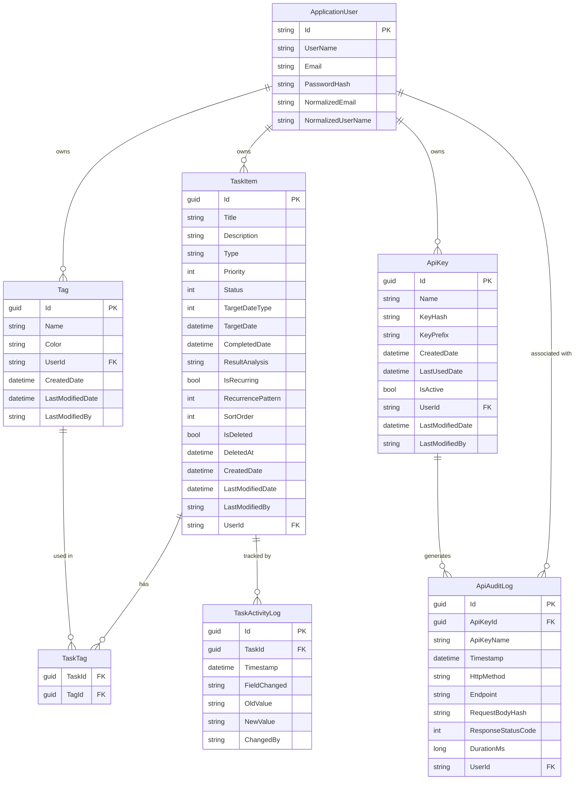

# TaskPilot — Architecture Specification

> **Iteration 1** (Local development, SQLite, dotnet user-secrets, dotnet run)
> Every decision is Azure-migration-ready. Local → Azure is a configuration change, not a rewrite.

---

## Table of Contents
1. [Solution Structure](#1-solution-structure)
2. [Entity Relationship Diagram](#2-entity-relationship-diagram)
3. [API Endpoint Specification](#3-api-endpoint-specification)
4. [Authentication & Security Design](#4-authentication--security-design)
5. [Coding Standards & Patterns](#5-coding-standards--patterns)
6. [Database Indexing Strategy](#6-database-indexing-strategy)
7. [Azure Migration Map](#7-azure-migration-map)
8. [Iteration 2 Backlog](#8-iteration-2-backlog)
9. [Package Decisions](#9-package-decisions)
10. [Configuration Guide](#10-configuration-guide)

---

## 1. Solution Structure

```
c:\projects\TaskPilot\
├── TaskPilot.slnx
├── ARCHITECTURE.md             ← This file
├── CLAUDE.md                   ← Agent coding conventions
├── DESIGN-SYSTEM.md            ← UX visual spec
├── WIREFRAMES.md               ← Page layout specs
├── USER-FLOWS.md               ← Interaction flows
├── README.md
├── .gitignore
│
├── src/                        ← Single application project (TaskPilot)
│   ├── TaskPilot.csproj        ← ASP.NET Core 10 Web + Razor Pages
│   ├── Program.cs              ← App entry point, middleware pipeline
│   ├── appsettings.json
│   ├── appsettings.Development.json
│   │
│   ├── Controllers/            ← REST API (namespace: TaskPilot.Controllers)
│   │   ├── BaseApiController.cs
│   │   ├── TasksController.cs
│   │   ├── TagsController.cs
│   │   ├── ApiKeysController.cs
│   │   ├── AuditController.cs
│   │   ├── ActivityLogController.cs
│   │   └── AccountController.cs
│   │
│   ├── Pages/                  ← Razor Pages web UI (namespace: TaskPilot.Pages)
│   │   ├── _ViewImports.cshtml
│   │   ├── _ViewStart.cshtml
│   │   ├── Index.cshtml(.cs)   ← Dashboard
│   │   ├── Error.cshtml(.cs)
│   │   ├── Auth/
│   │   │   ├── Login.cshtml(.cs)
│   │   │   ├── Register.cshtml(.cs)
│   │   │   └── Logout.cshtml(.cs)
│   │   ├── Tasks/
│   │   │   ├── Index.cshtml(.cs)   ← List + Board view
│   │   │   └── Detail.cshtml(.cs)  ← Edit / Complete / Delete
│   │   ├── Settings/
│   │   │   └── Index.cshtml(.cs)
│   │   ├── Audit/
│   │   │   └── Index.cshtml(.cs)
│   │   ├── Changelog/
│   │   │   └── Index.cshtml(.cs)   ← Read-only version history from app-changelog.json
│   │   └── Shared/
│   │       ├── _Layout.cshtml       ← Sidebar nav, Bootstrap 5 + HTMX + ApexCharts CDN
│   │       └── _LoginLayout.cshtml  ← Centered auth card layout
│   │
│   ├── app-changelog.json      ← Version history (no DB; read once at startup by ChangelogService)
│   │
│   ├── Models/                 ← DTOs, enums, validators (namespace: TaskPilot.Models)
│   │   ├── Tasks/
│   │   │   ├── TaskResponse.cs
│   │   │   ├── CreateTaskRequest.cs
│   │   │   ├── UpdateTaskRequest.cs
│   │   │   ├── PatchTaskRequest.cs
│   │   │   ├── CompleteTaskRequest.cs
│   │   │   └── TaskQueryParams.cs
│   │   ├── Tags/
│   │   │   ├── TagResponse.cs
│   │   │   └── CreateTagRequest.cs
│   │   ├── ApiKeys/
│   │   │   ├── ApiKeyResponse.cs
│   │   │   ├── CreateApiKeyRequest.cs
│   │   │   └── RenameApiKeyRequest.cs
│   │   ├── Audit/
│   │   │   └── AuditLogResponse.cs
│   │   ├── Changelog/
│   │   │   └── ChangelogModels.cs  ← ChangelogVersion, ChangelogEntry records
│   │   ├── Stats/
│   │   │   └── StatsResponse.cs
│   │   ├── Common/
│   │   │   └── ApiResponse.cs      ← Response envelope types
│   │   ├── Enums/
│   │   │   ├── TaskStatus.cs
│   │   │   ├── TaskPriority.cs
│   │   │   ├── TargetDateType.cs
│   │   │   └── RecurrencePattern.cs
│   │   └── Validators/
│   │       ├── CreateTaskRequestValidator.cs
│   │       ├── UpdateTaskRequestValidator.cs
│   │       ├── CreateTagRequestValidator.cs
│   │       └── CreateApiKeyRequestValidator.cs
│   │
│   ├── Services/               ← Business logic (namespace: TaskPilot.Services)
│   │   ├── Interfaces/
│   │   │   ├── ITaskService.cs
│   │   │   ├── ITagService.cs
│   │   │   ├── IApiKeyService.cs
│   │   │   ├── IAuditService.cs
│   │   │   ├── IActivityLogService.cs
│   │   │   ├── IChangelogService.cs
│   │   │   └── IStatsService.cs
│   │   ├── TaskService.cs
│   │   ├── TagService.cs
│   │   ├── ApiKeyService.cs
│   │   ├── AuditService.cs
│   │   ├── ActivityLogService.cs
│   │   ├── ChangelogService.cs     ← Singleton; reads app-changelog.json once at startup
│   │   └── StatsService.cs
│   │
│   ├── Repositories/           ← Data access (namespace: TaskPilot.Repositories)
│   │   ├── Interfaces/
│   │   │   ├── IRepository.cs       ← Generic CRUD interface
│   │   │   ├── ITaskRepository.cs
│   │   │   ├── ITagRepository.cs
│   │   │   ├── IApiKeyRepository.cs
│   │   │   └── IAuditLogRepository.cs
│   │   ├── GenericRepository.cs
│   │   ├── TaskRepository.cs
│   │   ├── TagRepository.cs
│   │   ├── ApiKeyRepository.cs
│   │   └── AuditLogRepository.cs
│   │
│   ├── Data/                   ← EF Core (namespace: TaskPilot.Data)
│   │   ├── ApplicationDbContext.cs
│   │   ├── DesignTimeDbContextFactory.cs  ← SQL Server factory for `dotnet ef migrations add`
│   │   ├── Configurations/
│   │   │   ├── TaskItemConfiguration.cs
│   │   │   ├── TagConfiguration.cs
│   │   │   ├── TaskTagConfiguration.cs
│   │   │   ├── ApiKeyConfiguration.cs
│   │   │   ├── ApiAuditLogConfiguration.cs
│   │   │   └── TaskActivityLogConfiguration.cs
│   │   └── Migrations/
│   │       └── (SQL Server migrations — applied by MigrateAsync on Azure, EnsureCreatedAsync on SQLite dev)
│   │
│   ├── Entities/               ← Domain entities (namespace: TaskPilot.Entities)
│   │   ├── BaseEntity.cs
│   │   ├── TaskItem.cs
│   │   ├── Tag.cs
│   │   ├── TaskTag.cs
│   │   ├── ApiKey.cs
│   │   ├── ApiAuditLog.cs
│   │   └── TaskActivityLog.cs
│   │
│   ├── Middleware/             ← Custom middleware (namespace: TaskPilot.Middleware)
│   │   ├── ApiAuditMiddleware.cs       ← Logs all API-key-authenticated requests
│   │   └── GlobalExceptionMiddleware.cs
│   │
│   ├── Extensions/             ← DI + pipeline + auth handler (namespace: TaskPilot.Extensions)
│   │   ├── ServiceCollectionExtensions.cs  ← All DI registrations
│   │   ├── ApplicationBuilderExtensions.cs ← Middleware pipeline helpers
│   │   └── ApiKeyAuthenticationHandler.cs  ← Custom X-Api-Key auth handler
│   │
│   ├── Constants/              ← App-wide constants (namespace: TaskPilot.Constants)
│   │   ├── ApiRoutes.cs
│   │   ├── AuthConstants.cs
│   │   ├── ErrorCodes.cs
│   │   └── TaskTypes.cs
│   │
│   └── wwwroot/
│       └── css/
│           └── app.css         ← Design system tokens + component styles
│
└── tests/
    ├── TaskPilot.Tests.Unit/
    │   ├── TaskPilot.Tests.Unit.csproj
    │   ├── Services/
    │   │   ├── TaskServiceTests.cs
    │   │   ├── TagServiceTests.cs
    │   │   └── ApiKeyServiceTests.cs
    │   ├── Validators/
    │   │   ├── CreateTaskRequestValidatorTests.cs
    │   │   └── CreateTagRequestValidatorTests.cs
    │   ├── Repositories/
    │   │   └── TaskRepositoryTests.cs
    │   └── Helpers/
    │       └── TestDataBuilder.cs
    │
    ├── TaskPilot.Tests.Integration/
    │   ├── TaskPilot.Tests.Integration.csproj
    │   ├── WebAppFactory.cs
    │   ├── Helpers/
    │   │   └── AuthHelper.cs
    │   └── Api/
    │       ├── TasksApiTests.cs
    │       ├── TagsApiTests.cs
    │       ├── ApiKeysApiTests.cs
    │       └── AuthApiTests.cs
    │
    └── TaskPilot.Tests.E2E/
        ├── TaskPilot.Tests.E2E.csproj
        ├── PlaywrightFixture.cs
        ├── Auth/
        │   └── AuthTests.cs
        ├── Dashboard/
        │   └── DashboardTests.cs
        ├── Tasks/
        │   └── TaskLifecycleTests.cs
        ├── Settings/
        │   └── SettingsTests.cs
        └── Audit/
            └── AuditTests.cs
```

---

## 2. Entity Relationship Diagram



---

## 3. API Endpoint Specification

All endpoints: `Content-Type: application/json`, wrapped in the standard response envelope.

### 3.1 Task Endpoints

| Method | Endpoint | Auth | Request | Success Response | Error Codes |
|--------|----------|------|---------|-----------------|-------------|
| GET | /api/v1/tasks | Cookie or ApiKey | Query: `TaskFilterParams` | 200 `ApiListResponse<TaskResponse>` | 401 |
| GET | /api/v1/tasks/{id} | Cookie or ApiKey | — | 200 `ApiResponse<TaskResponse>` | 401, 404 |
| POST | /api/v1/tasks | Cookie or ApiKey | `CreateTaskRequest` | 201 `ApiResponse<TaskResponse>` | 400, 401 |
| PUT | /api/v1/tasks/{id} | Cookie or ApiKey | `UpdateTaskRequest` | 200 `ApiResponse<TaskResponse>` | 400, 401, 404 |
| PATCH | /api/v1/tasks/{id} | Cookie or ApiKey | `PatchTaskRequest` | 200 `ApiResponse<TaskResponse>` | 400, 401, 404 |
| DELETE | /api/v1/tasks/{id} | Cookie or ApiKey | — | 204 | 401, 404 |
| POST | /api/v1/tasks/{id}/complete | Cookie or ApiKey | `CompleteTaskRequest` | 200 `ApiResponse<TaskResponse>` | 400, 401, 404, 409 |
| GET | /api/v1/tasks/stats | Cookie or ApiKey | Query: date range | 200 `ApiResponse<StatsResponse>` | 401 |

#### TaskFilterParams (query string)
```csharp
public record TaskFilterParams
{
    public TaskStatus? Status { get; init; }
    public string? Type { get; init; }
    public Priority? Priority { get; init; }
    public string? Search { get; init; }          // full-text on Title + Description
    public string? Tags { get; init; }             // comma-separated tag IDs
    public bool? IsRecurring { get; init; }
    public DateTime? TargetDateFrom { get; init; }
    public DateTime? TargetDateTo { get; init; }
    public int Page { get; init; } = 1;
    public int PageSize { get; init; } = 20;
    public string SortBy { get; init; } = "priority";
    public string SortDir { get; init; } = "asc";
}
```

#### CreateTaskRequest
```csharp
public record CreateTaskRequest
{
    public required string Title { get; init; }         // max 200
    public string? Description { get; init; }
    public required string Type { get; init; }           // "Work" | "Personal" | etc.
    public required Priority Priority { get; init; }
    public TaskStatus Status { get; init; } = TaskStatus.NotStarted;
    public required TargetDateType TargetDateType { get; init; }
    public DateTime? TargetDate { get; init; }
    public bool IsRecurring { get; init; } = false;
    public RecurrencePattern? RecurrencePattern { get; init; }
    public List<Guid> TagIds { get; init; } = [];
}
```

#### TaskResponse
```csharp
public record TaskResponse
{
    public required Guid Id { get; init; }
    public required string Title { get; init; }
    public string? Description { get; init; }
    public required string Type { get; init; }
    public required Priority Priority { get; init; }
    public required TaskStatus Status { get; init; }
    public required TargetDateType TargetDateType { get; init; }
    public DateTime? TargetDate { get; init; }
    public DateTime? CompletedDate { get; init; }
    public string? ResultAnalysis { get; init; }
    public required bool IsRecurring { get; init; }
    public RecurrencePattern? RecurrencePattern { get; init; }
    public required int SortOrder { get; init; }
    public required DateTime CreatedDate { get; init; }
    public required DateTime LastModifiedDate { get; init; }
    public required string LastModifiedBy { get; init; }
    public required List<TagResponse> Tags { get; init; }
}
```

### 3.2 Tag Endpoints

| Method | Endpoint | Auth | Request | Success Response | Error Codes |
|--------|----------|------|---------|-----------------|-------------|
| GET | /api/v1/tags | Cookie or ApiKey | — | 200 `ApiListResponse<TagResponse>` | 401 |
| POST | /api/v1/tags | Cookie or ApiKey | `CreateTagRequest` | 201 `ApiResponse<TagResponse>` | 400, 401, 409 |
| PUT | /api/v1/tags/{id} | Cookie or ApiKey | `UpdateTagRequest` | 200 `ApiResponse<TagResponse>` | 400, 401, 404 |
| DELETE | /api/v1/tags/{id} | Cookie or ApiKey | — | 204 | 401, 404 |

### 3.3 API Key Endpoints

| Method | Endpoint | Auth | Request | Success Response | Error Codes |
|--------|----------|------|---------|-----------------|-------------|
| GET | /api/v1/apikeys | Cookie | — | 200 `ApiListResponse<ApiKeyResponse>` | 401 |
| POST | /api/v1/apikeys | Cookie | `GenerateApiKeyRequest` | 201 `ApiResponse<GeneratedApiKeyResponse>` | 400, 401 |
| PATCH | /api/v1/apikeys/{id}/deactivate | Cookie | — | 200 `ApiResponse<ApiKeyResponse>` | 401, 404 |
| PATCH | /api/v1/apikeys/{id}/activate | Cookie | — | 200 `ApiResponse<ApiKeyResponse>` | 401, 404 |
| DELETE | /api/v1/apikeys/{id} | Cookie | — | 204 | 401, 404 |

> Note: `GeneratedApiKeyResponse` includes the plaintext `FullKey` field. This is the ONLY time the plaintext key is returned. After this response, the key cannot be retrieved.

### 3.4 Audit Log Endpoints

| Method | Endpoint | Auth | Request | Success Response | Error Codes |
|--------|----------|------|---------|-----------------|-------------|
| GET | /api/v1/audit | Cookie/ApiKey | Query: `AuditQueryParams` | 200 `PagedApiResponse<AuditLogResponse>` | 401 |
| GET | /api/v1/audit/summary | Cookie/ApiKey | — | 200 `ApiResponse<AuditSummaryResponse>` | 401 |

> There are NO write endpoints for API audit logs. Audit logs are immutable.

### 3.5 Activity Log Endpoints

| Method | Endpoint | Auth | Request | Success Response | Error Codes |
|--------|----------|------|---------|-----------------|-------------|
| GET | /api/v1/activity-logs | Cookie/ApiKey | Query: `ActivityLogQueryParams` | 200 `PagedApiResponse<ActivityLogResponse>` | 401 |

**Query parameters for `ActivityLogQueryParams`:**
- `taskId` (Guid?) — filter to a specific task
- `from` / `to` (DateTime?) — date range filter
- `fieldChanged` (string?) — exact field name filter (e.g. `Status`, `Title`)
- `changedBy` (string?) — partial match on modifier (e.g. `user:` or `api:`)
- `page` / `pageSize` (int, defaults: 1/50)

> Activity logs are read-only. They are written automatically whenever a task field is mutated.

### 3.5 Response Envelope Types

```csharp
// src/Models/Common/ApiResponse.cs
public record ApiResponse<T>
{
    public required T Data { get; init; }
    public required ResponseMeta Meta { get; init; }
}

public record ApiListResponse<T>
{
    public required List<T> Data { get; init; }
    public required ListResponseMeta Meta { get; init; }
}

public record ResponseMeta
{
    public required DateTime Timestamp { get; init; }
    public required string RequestId { get; init; }
}

public record ListResponseMeta : ResponseMeta
{
    public required int Page { get; init; }
    public required int PageSize { get; init; }
    public required int TotalCount { get; init; }
    public required int TotalPages { get; init; }
}

public record ApiErrorResponse
{
    public required ErrorDetail Error { get; init; }
}

public record ErrorDetail
{
    public required string Code { get; init; }
    public required string Message { get; init; }
    public List<FieldError>? Details { get; init; }
}

public record FieldError
{
    public required string Field { get; init; }
    public required string Message { get; init; }
}
```

---

## 4. Authentication & Security Design

### 4.1 Cookie Authentication (Web UI)

ASP.NET Core Identity with cookie authentication for the Razor Pages web UI.

**Password policy:**
- MinimumLength: 10
- RequireDigit: true
- RequireLowercase: true
- RequireUppercase: true
- RequireNonAlphanumeric: true

**Lockout policy:**
- DefaultLockoutTimeSpan: 15 minutes
- MaxFailedAccessAttempts: 5
- AllowedForNewUsers: true

**Cookie settings (iteration 1):**
```csharp
options.Cookie.HttpOnly = true;
options.Cookie.SameSite = SameSiteMode.Strict;
options.Cookie.SecurePolicy = CookieSecurePolicy.SameAsRequest; // → Always in iteration 2
options.ExpireTimeSpan = TimeSpan.FromDays(14);
options.SlidingExpiration = true;
```

### 4.2 API Key Authentication Handler

Custom `AuthenticationHandler<AuthenticationSchemeOptions>` reading the `X-Api-Key` header.

**Key generation:**
1. Generate 32 cryptographically random bytes: `RandomNumberGenerator.GetBytes(32)`
2. Encode to Base64URL string (43 chars): `Convert.ToBase64String(bytes).TrimEnd('=').Replace('+', '-').Replace('/', '_')`
3. Store prefix (first 8 chars) as `KeyPrefix` for display
4. Hash the full key with HMAC-SHA256: `HMACSHA256(key: secretSigningKey, data: apiKey)`
5. Store hex-encoded hash as `KeyHash`
6. Return the plaintext key to the user ONCE — never store or return it again

**Validation flow:**
1. Extract value from `X-Api-Key` header
2. Validate format (non-empty, length check)
3. Compute HMAC-SHA256 hash of received key
4. Look up `KeyHash` in `ApiKey` table (using hash — never plaintext lookup)
5. Verify `IsActive == true`
6. Update `LastUsedDate` (non-blocking fire-and-forget)
7. Set `ClaimsPrincipal` with user ID and API key name claims

**HMAC signing key** stored in `dotnet user-secrets` as `ApiKey:HmacSigningKey` (iteration 1), Azure Key Vault in iteration 2.

### 4.3 Audit Logging Middleware

`ApiKeyAuditMiddleware` fires on all requests authenticated via the API key scheme.

```csharp
// Captures per request:
// - ApiKeyId + ApiKeyName (from Claims)
// - Timestamp (UTC)
// - HttpMethod
// - Endpoint (path without query string)
// - RequestBodyHash: SHA256 of request body bytes (never store full body)
// - ResponseStatusCode (captured post-execution via wrapping the response stream)
// - DurationMs (Stopwatch)
// - UserId (from Claims)
```

Runs **after** authentication middleware, **before** routing. Records one `ApiAuditLog` row per request regardless of success/failure.

### 4.4 Soft Delete Pattern

Global EF Core query filter on `TaskItem`:
```csharp
// In ApplicationDbContext.OnModelCreating:
modelBuilder.Entity<TaskItem>()
    .HasQueryFilter(t => !t.IsDeleted);
```

Service-layer soft-delete:
```csharp
task.IsDeleted = true;
task.DeletedAt = DateTime.UtcNow;
await _repository.UpdateAsync(task);
```

Use `IgnoreQueryFilters()` only for:
- Undo operations (must retrieve the soft-deleted item)
- Admin/background cleanup jobs
- The 30-second undo window check

### 4.5 Security Headers Middleware

Sets on every response:
```
X-Content-Type-Options: nosniff
X-Frame-Options: DENY
Referrer-Policy: strict-origin-when-cross-origin
```

Iteration 2 additions (document only, not implemented in v1):
- `Strict-Transport-Security: max-age=31536000; includeSubDomains`
- `Content-Security-Policy: default-src 'self'; ...` (needs allowlisting for CDN domains in iteration 2)

### 4.6 Global Exception Handler Middleware

Catches all unhandled exceptions, logs full detail via `ILogger`, and returns the error envelope:

- **Development**: includes exception message
- **Production**: returns generic `"An unexpected error occurred"` — NO stack traces, NO internal type names, NO exception messages

Always returns `application/json` `Content-Type`.

### 4.7 CORS Policy

**Iteration 1 (localhost):**
```csharp
policy.SetIsOriginAllowed(origin => new Uri(origin).Host == "localhost")  // localhost dev
      .AllowAnyMethod()
      .AllowAnyHeader()
      .AllowCredentials();
```

**Iteration 2 (production):** Replace origin with the Azure App Service URL. Never use `AllowAnyOrigin()`.

### 4.8 Rate Limiting — Insertion Point (document only)

In `Program.cs`, rate limiting middleware inserts here:
```csharp
app.UseAuthentication();
app.UseAuthorization();
// ← INSERT: app.UseRateLimiter(); here in iteration 2
app.MapControllers();
```

**Iteration 2 policy design:** Per-API-key sliding window limiter using `RateLimitPartition.GetSlidingWindowLimiter` keyed on the API key ID claim. Web UI requests exempt. Configuration: 100 requests/minute per key default, configurable per key.

---

## 5. Coding Standards & Patterns

### 5.1 BaseEntity

```csharp
// src/Entities/BaseEntity.cs
public abstract class BaseEntity
{
    public Guid Id { get; set; } = Guid.NewGuid();
    public DateTime CreatedDate { get; set; }
    public DateTime LastModifiedDate { get; set; }
    public required string LastModifiedBy { get; set; }
}
```

### 5.2 DbContext SaveChangesAsync Override

```csharp
public override async Task<int> SaveChangesAsync(CancellationToken cancellationToken = default)
{
    var now = DateTime.UtcNow;
    foreach (var entry in ChangeTracker.Entries<BaseEntity>())
    {
        if (entry.State == EntityState.Added)
            entry.Entity.CreatedDate = now;
        if (entry.State is EntityState.Added or EntityState.Modified)
            entry.Entity.LastModifiedDate = now;
    }
    return await base.SaveChangesAsync(cancellationToken);
}
```

### 5.3 Generic Repository Interface

```csharp
// src/Repositories/Interfaces/IRepository.cs
public interface IRepository<T> where T : BaseEntity
{
    Task<T?> GetByIdAsync(Guid id, CancellationToken ct = default);
    Task<List<T>> GetAllAsync(CancellationToken ct = default);
    Task<T> AddAsync(T entity, CancellationToken ct = default);
    Task<T> UpdateAsync(T entity, CancellationToken ct = default);
    Task DeleteAsync(Guid id, CancellationToken ct = default);
    Task<bool> ExistsAsync(Guid id, CancellationToken ct = default);
}
```

### 5.4 Specialized ITaskRepository

```csharp
public interface ITaskRepository : IRepository<TaskItem>
{
    Task<PagedResult<TaskItem>> GetFilteredAsync(TaskFilterParams filters, string userId, CancellationToken ct = default);
    Task<List<TaskItem>> GetByUserAsync(string userId, CancellationToken ct = default);
    Task<TaskItem?> GetWithTagsAsync(Guid id, string userId, CancellationToken ct = default);
    Task UpdateSortOrderAsync(List<(Guid Id, int SortOrder)> updates, CancellationToken ct = default);
}
```

### 5.5 ServiceCollectionExtensions

```csharp
// src/Extensions/ServiceCollectionExtensions.cs
public static class ServiceCollectionExtensions
{
    public static IServiceCollection AddTaskPilotServices(this IServiceCollection services, IConfiguration configuration)
    {
        // Repositories
        services.AddScoped(typeof(IRepository<>), typeof(Repository<>));
        services.AddScoped<ITaskRepository, TaskRepository>();
        services.AddScoped<ITagRepository, TagRepository>();
        services.AddScoped<IApiKeyRepository, ApiKeyRepository>();
        services.AddScoped<IAuditRepository, AuditRepository>();

        // Services
        services.AddScoped<ITaskService, TaskService>();
        services.AddScoped<ITagService, TagService>();
        services.AddScoped<IApiKeyService, ApiKeyService>();
        services.AddScoped<IAuditService, AuditService>();
        services.AddScoped<IStatsService, StatsService>();

        // Validators
        services.AddValidatorsFromAssemblyContaining<CreateTaskRequestValidator>();
        services.AddFluentValidationAutoValidation();

        return services;
    }
}
```

### 5.6 Controller Pattern (NO business logic)

```csharp
[ApiController]
[Route("api/v1/tasks")]
[Authorize]
public class TasksController : ControllerBase
{
    private readonly ITaskService _taskService;
    private readonly ILogger<TasksController> _logger;

    public TasksController(ITaskService taskService, ILogger<TasksController> logger)
    {
        _taskService = taskService;
        _logger = logger;
    }

    /// <summary>Creates a new task.</summary>
    [HttpPost]
    public async Task<IActionResult> CreateAsync([FromBody] CreateTaskRequest request, CancellationToken ct)
    {
        // FluentValidation runs automatically via middleware — no manual validation here
        var userId = User.GetUserId();   // extension method on ClaimsPrincipal
        var result = await _taskService.CreateAsync(request, userId, ct);
        return CreatedAtAction(nameof(GetByIdAsync), new { id = result.Id },
            new ApiResponse<TaskResponse> { Data = result, Meta = ResponseMeta.Now() });
    }
}
```

### 5.7 Layering Rule

```
HTTP Request
    → FluentValidation (auto, before controller)
    → Controller (extract claims, call service, wrap response)
    → Service (business logic, orchestration, activity log writes)
    → Repository (data access only, no logic)
    → DbContext (EF Core, SaveChanges auto-sets dates)
```

**Never**: Controller → DbContext. Service → HttpContext. Repository → another Service.

---

## 6. Database Indexing Strategy

All indexes defined in `IEntityTypeConfiguration<T>` classes.

| Table | Index | Justification |
|-------|-------|---------------|
| TaskItem | `(UserId, IsDeleted, Status)` | Primary filter for task list views (all user's active tasks by status) |
| TaskItem | `(UserId, IsDeleted, TargetDate)` | Dashboard overdue calculation, date-range filtering |
| TaskItem | `(UserId, IsDeleted, CompletedDate)` | Dashboard completion charts (weekly/monthly/yearly aggregations) |
| TaskItem | `(UserId, IsDeleted, Priority)` | Default sort within status groups |
| TaskItem | `(UserId, IsDeleted, Type)` | Type-filter on task list, type breakdown chart |
| ApiAuditLog | `(UserId, Timestamp DESC)` | Audit dashboard default view (user's audit logs newest-first) |
| ApiAuditLog | `(ApiKeyId, Timestamp DESC)` | Per-key filtering in audit dashboard |
| TaskActivityLog | `(TaskId, Timestamp DESC)` | Task detail activity feed (chronological per task) |
| ApiKey | `KeyHash` UNIQUE | API key lookup during authentication (must be fast + unique) |
| ApiKey | `(UserId, IsActive)` | List user's active keys in Settings |
| Tag | `(UserId, Name)` UNIQUE | Prevent duplicate tag names per user, lookup by name |

---

## 7. Azure Migration Map

| Concern | Iteration 1 (Local) | Iteration 2 (Azure) | Migration Steps |
|---------|---------------------|---------------------|-----------------|
| **Database** | SQLite, file-based | Azure SQL Database or PostgreSQL Flexible Server | ✅ **Implemented (iter 1):** `Microsoft.EntityFrameworkCore.SqlServer` added; `DesignTimeDbContextFactory` generates SQL Server-typed migrations; `Program.cs` runs `EnsureCreatedAsync` (dev) vs `MigrateAsync` (prod); `appsettings.Production.json` has placeholder connection string |
| **Secrets** | `dotnet user-secrets` | Azure Key Vault | 1. Add `Azure.Extensions.AspNetCore.Configuration.Secrets` 2. Add `Azure.Identity` 3. In `Program.cs`: `builder.Configuration.AddAzureKeyVault(...)` 4. Replace `user-secrets` key names with Key Vault secret names |
| **Logging** | Console + File (Serilog) | Application Insights | ✅ **Partially implemented (iter 1):** `appsettings.Production.json` configures Console-only Serilog (no file sink — App Service filesystem is ephemeral). Full App Insights integration deferred to iter 2. |
| **Hosting** | `dotnet run` | Azure App Service (Linux) | 1. Configure App Service: WebSockets ON, Session Affinity ON 2. Set `ASPNETCORE_ENVIRONMENT=Production` in App Settings 3. Deploy via GitHub Actions (see iteration 2 backlog) |
| **Static Files** | `wwwroot/` served by Kestrel | Azure App Service static file serving | No change needed — App Service serves `wwwroot/` automatically |
| **CORS** | `SetIsOriginAllowed(localhost)` | Azure app URL | Change to `WithOrigins("https://yourdomain.azurewebsites.net")` in `appsettings.Production.json` |
| **Cookie Security** | `SameAsRequest` (allows HTTP locally) | `CookieSecurePolicy.Always` | Change in `appsettings.Production.json` or env var override |
| **Rate Limiting** | Not implemented | `Microsoft.AspNetCore.RateLimiting` | See iteration 2 backlog. Insertion point documented in section 4.8. |
| **Background Jobs** | In-process (soft-delete cleanup) | Azure Functions or hosted services | Evaluate Azure Functions for scheduled cleanup if App Service scaling is needed |
| **CI/CD** | Manual `dotnet run` | GitHub Actions → Azure | See iteration 2 backlog |

**Configuration switch pattern** (`Program.cs`):
```csharp
if (builder.Environment.IsProduction())
{
    // Azure Key Vault
    builder.Configuration.AddAzureKeyVault(...);
    // Azure SQL / PostgreSQL provider swap happens via connection string
}
```

---

## 8. Iteration 2 Backlog

### Rate Limiting
- **Package**: `Microsoft.AspNetCore.RateLimiting` (built into ASP.NET Core 8+)
- **Insertion point**: After `app.UseAuthorization()`, before `app.MapControllers()` (see section 4.8)
- **Policy**: Per-API-key sliding window: 100 req/min default, configurable in DB per ApiKey record
- **Web UI exemption**: Cookie-authenticated requests bypass rate limiting
- **429 response**: Standard error envelope with `Retry-After` header

### PWA Support
- Add `service-worker.js` to Client's `wwwroot`
- Configure `manifest.webmanifest`
- Implement offline fallback page
- Consider background sync for quick-add while offline

### CI/CD (GitHub Actions)
- Build + test workflow on PR
- Deploy workflow on merge to main: build → test → publish → deploy to Azure App Service
- Separate staging slot for preview deployments

### Azure App Service Configuration
- Enable WebSockets (not required for Razor Pages, but harmless and useful for future SignalR)
- Session Affinity: ON (for cookie auth consistency)
- Always On: ON (prevent cold starts)
- Health check endpoint: `GET /health` returning 200

### Application Insights
- Custom telemetry: track task completion events, API key usage
- Smart Detection alerts for error rate spikes
- Availability tests (ping tests from multiple regions)

---

## 9. Package Decisions

### Charting Library: ApexCharts (CDN)

**Decision: ApexCharts via CDN** — no NuGet package required

**Rationale:**
- Supports all required chart types: bar (weekly completions), donut (by priority) — with first-class support
- CDN delivery via `<script src="https://cdn.jsdelivr.net/npm/apexcharts">` — zero NuGet dependencies
- Charts initialised with inline `<script>` blocks in Razor views using JSON config
- Active maintenance, large community, excellent documentation

**Rejected alternatives:**
- `Blazor-ApexCharts` (NuGet): Requires Blazor WASM; not applicable to Razor Pages
- `Chart.js`: Comparable but ApexCharts has better donut/bar defaults for dashboards

### UI Stack: Bootstrap 5 + HTMX (CDN)

**Decision: Bootstrap 5 + HTMX + custom CSS** — no NuGet package required

**Rationale:**
- Bootstrap 5 provides modals, tables, forms, badges, buttons — all needed components
- HTMX enables live search (`hx-get`/`hx-trigger`) without JavaScript boilerplate
- Custom CSS in `wwwroot/css/app.css` implements design system tokens (see DESIGN-SYSTEM.md §1)
- All via CDN in `_Layout.cshtml` — zero build tooling

### Complete NuGet Package List

#### TaskPilot (src/TaskPilot.csproj)
```xml
<PackageReference Include="Microsoft.AspNetCore.Identity.EntityFrameworkCore" Version="10.*" />
<PackageReference Include="Microsoft.EntityFrameworkCore.Sqlite" Version="10.*" />
<PackageReference Include="Microsoft.EntityFrameworkCore.SqlServer" Version="10.*" />  <!-- Added iter 1: Azure SQL provider for migrations + production -->
<PackageReference Include="Microsoft.EntityFrameworkCore.Design" Version="10.*" />
<PackageReference Include="Microsoft.EntityFrameworkCore.Tools" Version="10.*" />
<PackageReference Include="FluentValidation.AspNetCore" Version="11.*" />
<PackageReference Include="Serilog.AspNetCore" Version="10.*" />
<PackageReference Include="Serilog.Sinks.Console" Version="6.*" />
<PackageReference Include="Serilog.Sinks.File" Version="7.*" />
<PackageReference Include="Swashbuckle.AspNetCore" Version="10.*" />
<!-- Iteration 2:
<PackageReference Include="Azure.Extensions.AspNetCore.Configuration.Secrets" />
<PackageReference Include="Microsoft.ApplicationInsights.AspNetCore" />
<PackageReference Include="Serilog.Sinks.ApplicationInsights" />
-->
```

#### TaskPilot.Tests.Unit
```xml
<PackageReference Include="xunit" Version="2.*" />
<PackageReference Include="xunit.runner.visualstudio" Version="2.*" />
<PackageReference Include="Microsoft.NET.Test.Sdk" Version="17.*" />
<PackageReference Include="Moq" Version="4.*" />
<PackageReference Include="Microsoft.EntityFrameworkCore.InMemory" Version="10.*" />
```

#### TaskPilot.Tests.Integration
```xml
<PackageReference Include="xunit" Version="2.*" />
<PackageReference Include="xunit.runner.visualstudio" Version="2.*" />
<PackageReference Include="Microsoft.NET.Test.Sdk" Version="17.*" />
<PackageReference Include="Microsoft.AspNetCore.Mvc.Testing" Version="10.*" />
<PackageReference Include="Microsoft.EntityFrameworkCore.Sqlite" Version="10.*" />
```

#### TaskPilot.Tests.E2E
```xml
<PackageReference Include="xunit" Version="2.*" />
<PackageReference Include="xunit.runner.visualstudio" Version="2.*" />
<PackageReference Include="Microsoft.NET.Test.Sdk" Version="17.*" />
<PackageReference Include="Microsoft.Playwright" Version="1.*" />
```

---

## 10. Configuration Guide

### appsettings.json (checked into source control — NO secrets)
```json
{
  "Logging": {
    "LogLevel": {
      "Default": "Information",
      "Microsoft.AspNetCore": "Warning",
      "Microsoft.EntityFrameworkCore": "Warning"
    }
  },
  "AllowedHosts": "*",
  "ConnectionStrings": {
    "DefaultConnection": "placeholder-overridden-by-environment"
  },
  "Cors": {
    "AllowedOrigins": ["https://localhost:7001"]
  },
  "ApiKey": {
    "HmacSigningKey": "placeholder-overridden-by-user-secrets"
  },
  "Serilog": {
    "MinimumLevel": {
      "Default": "Information",
      "Override": {
        "Microsoft": "Warning",
        "System": "Warning"
      }
    },
    "WriteTo": [
      { "Name": "Console" },
      {
        "Name": "File",
        "Args": { "path": "logs/taskpilot-.log", "rollingInterval": "Day" }
      }
    ],
    "Enrich": ["FromLogContext", "WithMachineName", "WithThreadId"]
  }
}
```

### appsettings.Development.json
```json
{
  "ConnectionStrings": {
    "DefaultConnection": "Data Source=taskpilot-dev.db"
  },
  "Logging": {
    "LogLevel": {
      "Microsoft.EntityFrameworkCore.Database.Command": "Information"
    }
  }
}
```

### appsettings.Production.json
```json
{
  "Logging": {
    "LogLevel": {
      "Default": "Warning"
    }
  }
}
```

### dotnet user-secrets (iteration 1 local development)
```bash
dotnet user-secrets init --project src
dotnet user-secrets set "ConnectionStrings:DefaultConnection" "Data Source=C:/projects/TaskPilot/taskpilot-dev.db" --project src
dotnet user-secrets set "ApiKey:HmacSigningKey" "<random-256-bit-key>" --project src
```

### Environment Variables (override any appsettings key)
ASP.NET Core uses `__` (double underscore) as hierarchy separator:
```
ConnectionStrings__DefaultConnection=...
ApiKey__HmacSigningKey=...
ASPNETCORE_ENVIRONMENT=Development|Production
```

### Azure Configuration (iteration 2)
```csharp
// Program.cs addition for iteration 2:
if (builder.Environment.IsProduction())
{
    var keyVaultUri = new Uri(builder.Configuration["Azure:KeyVaultUri"]!);
    builder.Configuration.AddAzureKeyVault(keyVaultUri, new DefaultAzureCredential());
}
```

Azure Key Vault secret naming convention (maps to `ConnectionStrings:DefaultConnection`):
```
ConnectionStrings--DefaultConnection   ← double dash in Key Vault = colon in IConfiguration
ApiKey--HmacSigningKey
```

### Configuration Keys (constants)
```csharp
// src/Constants/ConfigKeys.cs
public static class ConfigKeys
{
    public const string DefaultConnection = "ConnectionStrings:DefaultConnection";
    public const string ApiKeyHmacSigningKey = "ApiKey:HmacSigningKey";
    public const string CorsAllowedOrigins = "Cors:AllowedOrigins";
}
```

---

## Dockerfile (for Azure Container Apps — iteration 2)

```dockerfile
FROM mcr.microsoft.com/dotnet/aspnet:10.0 AS base
WORKDIR /app
EXPOSE 80
EXPOSE 443

FROM mcr.microsoft.com/dotnet/sdk:10.0 AS build
WORKDIR /src
COPY ["src/TaskPilot.csproj", "src/"]
RUN dotnet restore "src/TaskPilot.csproj"
COPY . .
RUN dotnet publish "src/TaskPilot.csproj" -c Release -o /app/publish

FROM base AS final
WORKDIR /app
COPY --from=build /app/publish .
ENTRYPOINT ["dotnet", "TaskPilot.dll"]
```
